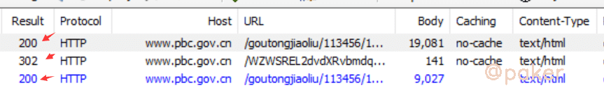
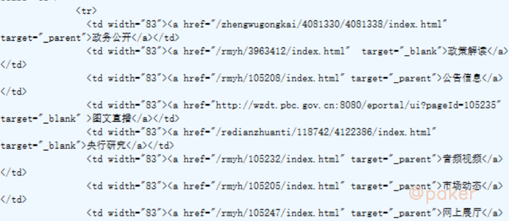

tags: spider js逆向
date: 2021年8月9日
title: 人民银行sojsonv6&wzws_cid
private: false

# 人民银行sojsonv6&wzws_cid

遇到sojsonv6混淆的js代码怎么办（特征'js\*\*\*mi.com.v6'）？例子来了，我们来学习下人民银行对于sojson混淆的使用。

网站地址：

> aHR0cDovL3d3dy5wYmMuZ292LmNuL2dvdXRvbmdqaWFvbGl1LzExMzQ1Ni8xMTM0N
>
> jkvaW5kZXguaHRtbA==

## 1.抓包分析

使用fiddler抓包，(1)200->(2)302->(3)200，这里我们分成三步



**第一步**

不带cookie访问首页时，响应set-cookie：wzws_cid=\*\*\*，网页正文为一段混淆的js


**第二步**

带着第一步的set-cookie，访问第一步js生成的重定向url（www.\*\*\*.gov.cn/WZWSREL2dvdXRvbmdqaWFvbGl1LzQ1Ni8xMTMNjkvaW5kZXguaHRtbA==?wzwschallenge=V1pXU19DT05GSVJNX1BSR9MQUJFTDE5Njc4OTE=），得到响应新的set-cookie

**第三步**

带着第二步的set-cookie访问首页url，成功获取网页文本



## 2.AST简单还原混淆的js

第一步返回的js是sojsonv6混淆后的，直接复制到本地(不要格式化，sojson对格式化有检测，会让代码卡死)，核心的东西就在这了


通过AST，在调用了解密方法的地方，计算出值，节点替换，代码会变得易读很多（上面图片那段js在还原后可以删除）

> AST部分: '_0x4ce3' === path.node.callee.name
>
> ​				_0x4ce3.apply(null, args)

还原后的样子


只是简单的还原我们就能找到第二步重定向url生成的地方了，如果还觉得不够清爽我们可以进一步还原，比如对象还原，简单表达式计算，控制流还原。。。

## 3.让代码跑起来

很明显重定向的url生成的地方在window["location"] = ，但是你直接运行是没有结果的，改改删删就可以了，我好像没有打断点分析。

**定时器干掉**

> ```
> window.setInterval = function(){
> }
> ```

**没用的代码删掉(死循环，内存爆破等)，注意注释掉的那部分**


**注意动态部分，需要自己用re正则截取**


## 4.小技巧

虽然抓包看它是一个GET请求，需要三步才能完成

把GET改成POST试一试，一步到位
