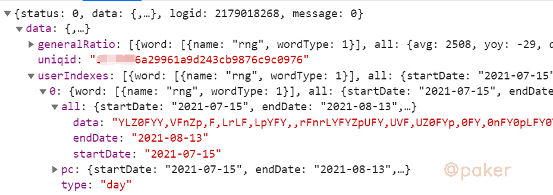
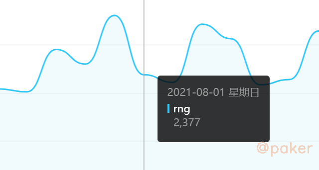

tags: spider js逆向
date: 2021年8月14日
title: 入门-某度指数解密方法
private: false

# 入门-某度指数解密方法

最近某度指数更新了数据请求接口以及http->https，目前解密方法还和19年一样

## 1.抓包分析



data那行为加密的数据



网页上我们能看到每天的指数明文值

也就是说接口返回数据后，一定经过js解密后渲染，最终呈现了明文指数值

## 2.定位

全局搜搜搜接口返回数据的字段名称"userIndexes"，会在main js中找到这样一段代码

> (t.userIndexes) && t.userIndexes.forEach(function(t, i) {
>                                 var a = []
>                                   , r = []
>                                   , o = [];
>                                 e && (a = H.a.decrypt(e.data, t.all.data).split(","),

已经很明显了，和接口返回的数据字段一一对应，“userIndexes”，“all”，“data”，关键就在decrypt这个方法里

> decrypt: function(t, e) {
>             if (t) {
>                 // 解密逻辑
>                 return r.join("")
>             }
>         }

e就是接口返回数据的加密部分，t的值来自于接口ptbk?uniqid=\*\*\*，uniqid来于自加密数据的接口

## 3.python实现解密方法

```python
def decrypt_func(key, data):
    a = key
    i = data
    n = {}
    s = []
    for o in range(len(a)//2):
        n[a[o]] = a[len(a)//2 + o]
    for r in range(len(data)):
        s.append(n[i[r]])
    dd = ''.join(s).split(',')
    return dd
```