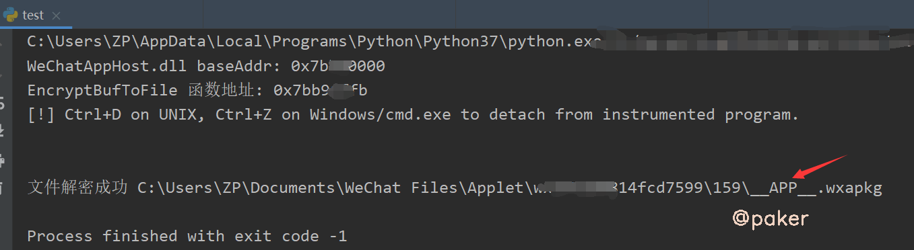
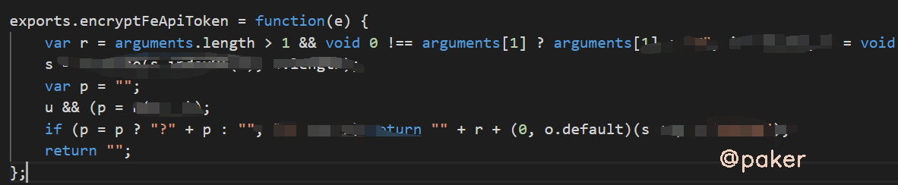

tags: spider 小程序逆向
date: 2021年8月19日
title: 微信小程序逆向(一)解包反编译
private: false

# 微信小程序逆向(一)解包反编译

小程序抓到包，发现加密参数，无从下手怎么办？以xhs为例，学习下如何搞定一个小程序的加密参数。首先我们需要看到代码逻辑，不能凭空想象。

## 1.手机小程序文件位置

手机连接电脑，进入adb shell su，手机需要root(也可以使用模拟器)

> /data/data/com.tencent.mm/MicroMsg/{这是一串hash，每个人不一样}/appbrand/pkg

在pkg文件夹下，我们可能发现多个.wxapkg文件，如果你是刚点开过微信小程序，那么就选择时间最近的那个文件（大小一般在1-2M）


可以运行adb命令，将整个pkg文件夹拷贝到电脑上来

> adb pull /data/data/com.tencent.mm/MicroMsg/{这是一串hash，每个人不一样}/appbrand/pkg ./

## 2.PC小程序文件位置

获取手机小程序文件步骤比较繁琐，下面介绍另一种方式，frida hook pc微信，直接找到小程序文件位置

```python
# -*- coding: UTF-8 -*-
# @Time : 2021/3/2 17:56

import frida
import sys

# 生成文件路径 C:\Users\{User}\Documents\WeChat Files\Applet\...

def on_message(message, data):
    pass

def main(target_process):
    session = frida.attach(target_process)
    script = session.create_script("""
var baseAddr = Module.findBaseAddress('WeChatAppHost.dll');
console.log('WeChatAppHost.dll baseAddr: ' + baseAddr);


var EncryptBufToFile = Module.findExportByName('WeChatAppHost.dll', 'EncryptBufToFile');

if (EncryptBufToFile) {

    console.log('EncryptBufToFile 函数地址: ' + EncryptBufToFile);

    // HOOK函数, 监听参数
    Interceptor.attach(EncryptBufToFile, {
        onEnter: function (args) {
            // console.log(`${args[0]},${args[1]},${args[2]},${args[3]}`);
            // 微信小程序AppId
            this.appId = ptr(args[0]).readPointer().readAnsiString();
            // 微信小程序本地缓存文件路径
            this.apkgFilePath = ptr(args[1]).readPointer().readAnsiString();
            // 小程序代码原始内容(未加密)
            this.originalData = Memory.readByteArray(args[2], args[3].toInt32());
        },
        onLeave: function (retval) {
            console.log('文件解密成功', this.apkgFilePath);

            // 将文件替换为未加密的wxapkg包
            var f = new File(this.apkgFilePath, 'wb');
            f.write(this.originalData);
            f.flush();
            f.close();

            // 释放内存
            delete this.appId;
            delete this.apkgFilePath;
            delete this.originalData;
        }
    });

} else {
    console.log('WeChatAppHost.dll 模块未加载, 请先打开界面中的小程序面板');
}
""")
    script.on('message', on_message)
    script.load()
    print("[!] Ctrl+D on UNIX, Ctrl+Z on Windows/cmd.exe to detach from instrumented program.\n\n")
    sys.stdin.read()
    session.detach()


if __name__ == '__main__':
    main('wechat.exe')
```

使用方法：

- pc微信运行状态

- 运行以上脚本

- 点击目标小程序，查看输出结果，大功告成

    

注意，可能有多个.wxapkg文件，主要关注__APP__.wxapkg文件即可

## 3.解包反编译

用到的工具，**wxappUnpacker**，这个教程太多了，不多赘述

> 运行命令 node wuWxapkg.js  ./xhs.wxapkg

就会在当前文件夹生成解包后的文件夹 xhs


**可能遇到的坑****，****因为反编译的问题，有时解析失败，比如文件夹名plugin变为plugin:，导致解包失败**

```
D:\worksoft\nodeworkspace\wxappunpacker\wuLib.js:91
        if (err) throw Error("Save file error: " + err);
                 ^

Error: Save file error: Error: ENOENT: no such file or directory, open
```

**根据报错信息修改wuLib.js这个文件即可，比如这样**


## 4.静态查看

可以用vscode打开解包反编译后的文件夹，已知xhs小程序header里有X-sign参数加密，我们先全局搜索定位

> exports.DEFAULT_SIGN_HEADER = "X-Sign";

接着搜搜DEFAULT_SIGN_HEADER 

> t.header[u.DEFAULT_SIGN_HEADER] = (0, u.encryptFeApiToken)(g);

encryptFeApiToken方法看起来就是加密函数了，ctrl+左键跳转过去



到此结束，静态分析我们猜测不到传入的参数和加密逻辑，下一篇我们把它运行起来，动态调试看看