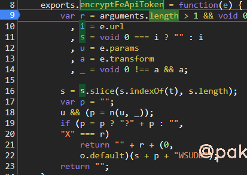
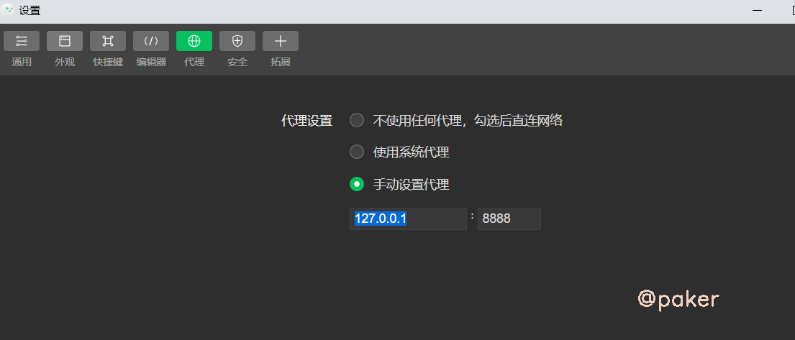
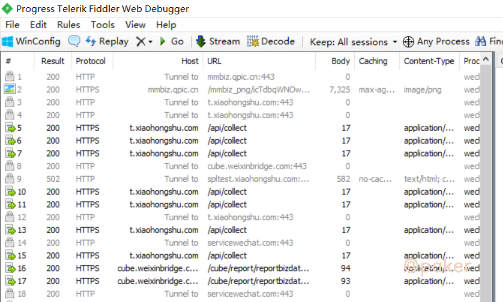

tags: 微信小程序逆向(二)动态调试
date: 2021年8月21日
title: 微信小程序逆向(二)动态调试
private: false

# 微信小程序逆向(二)动态调试

上一篇我们获取到了解包反编译后的小程序文件，此篇使用微信开发者工具，让程序运行起来，动态调试。

微信开发者工具下载地址：https://developers.weixin.qq.com/miniprogram/dev/devtools/download.html

## 1.导入项目

选择上一篇解包得到的xhs文件夹，使用测试号即可


一个重要的设置：设置-》项目设置-》不校验合法域名，这个要勾选上


## 2.常见的编译报错


当点了编译后，在控制台一般会输出几种报错，需要自己处理一下

**报错一**

> [ WXML 文件编译错误] ./pages/search/index/index.wxml
>  Bad attr `filterStyle` with message
>   20 |                 <view class="{{['data-v-689734e0',true?'tab-title':'',tabIndex===index?'active':'']}}">{{''+item.name+''}}</view>
>   21 |             </view>
>
> > 22 |             <sort-list bind:__l="__l" bind:callBack="__e" class="data-v-689734e0 vue-ref-in-for" data-event-opts="{{[ [ '^callBack',[ ['filterCallBack'] ] ] ]}}" data-ref="{{'sort_'+index}}" filterStyle="{{top:0}}" sortList="{{item}}" vueId="{{'a2b08582-1-'+index}}" wx:if="{{!(index===1||index===4)}}" wx:for="{{sortList}}" wx:key="index"></sort-list>

找到对应文件位置，将**filterStyle="{{top:0}}"**  修改为 **filterStyle="top:0"** ，filterStyle多了两个大括号

**报错二**

> TypeError: _typeof3 is not a function
>     at _typeof (typeof.js? [sm]:2)

@babel\runtime\helpers文件夹下面的typeof.js报错，因为本地装过这个包npm install --save @babel/runtime，直接进去拷一份typeof.js覆盖就好了，新typeof.js如下

```javascript
function _typeof(obj) {
  "@babel/helpers - typeof";

  if (typeof Symbol === "function" && typeof Symbol.iterator === "symbol") {
    module.exports = _typeof = function _typeof(obj) {
      return typeof obj;
    };

    module.exports["default"] = module.exports, module.exports.__esModule = true;
  } else {
    module.exports = _typeof = function _typeof(obj) {
      return obj && typeof Symbol === "function" && obj.constructor === Symbol && obj !== Symbol.prototype ? "symbol" : typeof obj;
    };

    module.exports["default"] = module.exports, module.exports.__esModule = true;
  }

  return _typeof(obj);
}

module.exports = _typeof;
module.exports["default"] = module.exports, module.exports.__esModule = true;
```

## 3.调试

正常会在network下看到请求的数据包


上一篇静态分析，根据字符串搜索我们已经定位到了x-sign加密函数的位置，下个断点看看



传入的参数e


追到这 s + p + "WSUDD"，发现和pc web端一模一样的加密方式，就是做了"X"+md5(api+"WSUDD")

```python
import hashlib
x_sign = "X"
m = hashlib.md5()
m.update((api+"WSUDD").encode())
x_sign = x_sign + m.hexdigest()
```

## 4.fiddler如何抓到微信开发者工具调试的包

微信开发者工具-》设置-》代理设置（默认是使用系统代理），打开fiddler，修改为手动设置代理



这样就能在fiddler抓到微信开发者调试工具的包了

