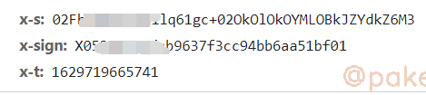
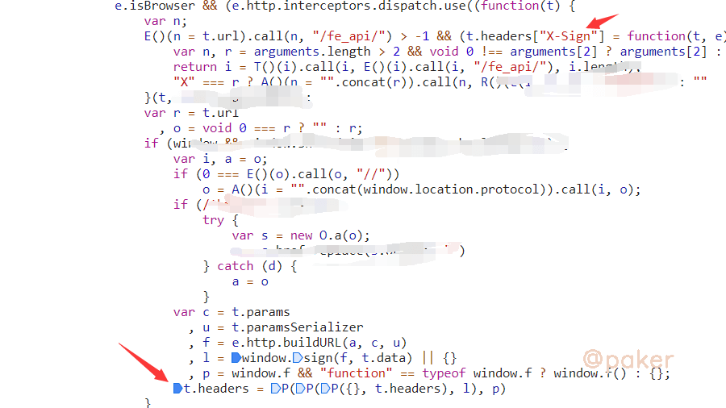
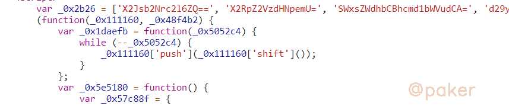
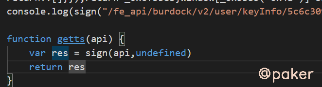

tags: spider js逆向
date: 2021年8月23日
title: 某红书web个人主页x-t&x-s&ob混淆
private: false

# 某红书web个人主页x-t&x-s&ob混淆

某红书web更新，加强了参数校验，x-t&x-s变成必要参数，x-sign加密方式暂未改变

## 1.抓包&定位

其中x-sign上篇文章已经搞定，同样在header里的参数x-t&x-s，应该和x-sign一起放在hedaer，直接去x-sign生成的位置看看，顺着代码顺着代码向下调试，箭头处对headers进行了赋值

> t.headers = P(P(P({}, t.headers), l), p)

调试可知，l 就是我们要找的x-t&x-s

> {
>     "X-s": "bslaUOlvpsjsl1B9G0j1WZB5bsgWZB93***",
>     "X-t": 1629720500512
> }

window.sign，就是我们最终要抠出来的加密方法了，参数f为api，t.data为undefined。追进去看看

被混淆了，从js的开头的特征看出来，应该是ob混淆的(大数组，定义的解密方法)

## 2.扣代码

鉴于混淆的不是特别严重，而且已知最后调用的sign方法，直接无脑扣下来即可(当然ast还原后看起来更加舒服)

直接运行会卡死，因为有格式化校验与环境检测，可以去这个网站把js压缩下再执行，[在线js压缩格式化工具](http://www.esjson.com/jsformat.html)

使用js proxy检查检测了哪些环境，navigator对象，alert方法

## 3.运行效果

