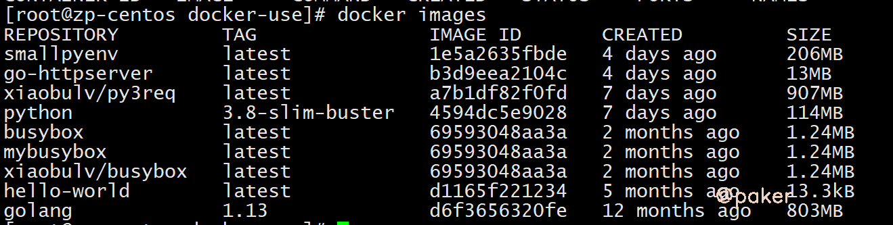
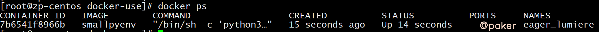
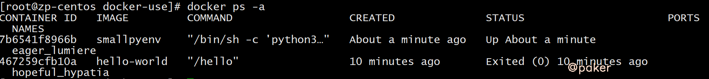
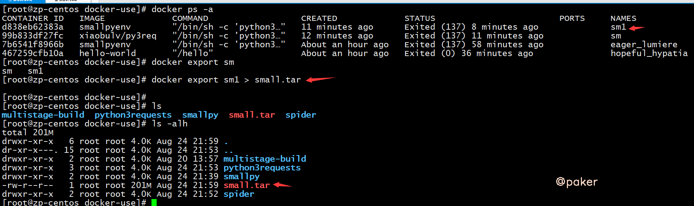
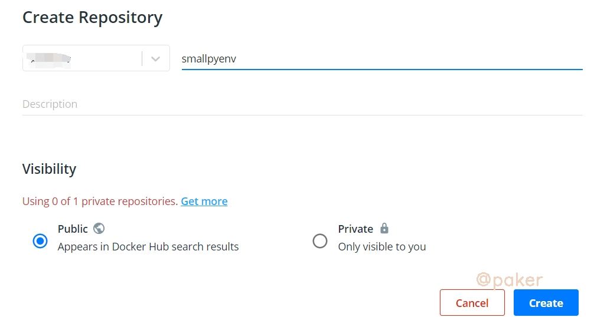

tags: docker linux
date: 2021年8月25日
title: Docker常用命令
private: false

# Docker常用命令

整理了Docker常用命令，记不住的方便查找

## 安装卸载

**卸载旧版Docker**

较旧的 Docker 版本称为 docker 或 docker-engine 。如果已安装这些程序，请卸载它们以及相关的依赖项。

```shell
sudo yum remove docker docker-client docker-client-latest docker-common docker-latest docker-latest-logrotate docker-logrotate docker-engine
```

**安装Docker**

首次安装 Docker 之前，需要添加 Docker 安装源

```shell
sudo yum-config-manager --add-repo https://download.docker.com/linux/centos/docker-ce.repo
```

安装最新版本的 Docker

```sh
sudo yum install -y docker-ce docker-ce-cli containerd.io
```

**启动docker**，类似还有**status** **stop restart**

```sh
sudo systemctl start docker
```

## 国际惯例，hello world

> docker run hello-world

运行上述命令，Docker 首先会检查本地是否有`hello-world`这个镜像，如果发现本地没有这个镜像，Docker 就会去 Docker Hub 官方仓库下载此镜像，然后运行它。最后我们看到该镜像输出 "Hello from Docker!" 并退出。


## 常用命令

**docker版本**

> docker -v

**查看本地镜像**

> docker images



**查看运行中的容器**

> docker ps



**查看所有容器**

> docker ps -a



**删除镜像**

> docker rmi centos          # 根据 REPOSITORY 来删除镜像
>
> docker rmi centos:v1       # 根据 REPOSITORY:TAG 来删除镜像
>
> docker rmi 1e1148e4cc2c    # 根据 IMAGE ID 来删除镜像，同时会删除所有该镜像的TAG镜像
>
> docker rmi -f 1e1148e42c   # 强制删除

**删除容器**

> docker rm hopeful_hypatia    # 根据NAMES来删除容器
>
> docker rm 467259cfb10a       # 根据CONTAINER ID来删除镜像
>
> docker rm -f 强制删除

**拉取镜像**

> docker pull busybox

命令格式一般为 docker pull [Registry]/[Repository]/[Image]:[Tag]

- Registry 为注册服务器，Docker 默认会从 docker.io 拉取镜像，如果你有自己的镜像仓库，可以把 Registry 替换为自己的注册服务器。
- Repository 为镜像仓库，通常把一组相关联的镜像归为一个镜像仓库，`library`为 Docker 默认的镜像仓库。
- Image 为镜像名称。
- Tag 为镜像的标签，如果你不指定拉取镜像的标签，默认为`latest`。

可自行去dockerhub寻找镜像，[dockerhub](https://hub.docker.com/)

**重命名镜像**

> docker tag busybox:latest mybusybox:latest

**构建镜像**

构建镜像主要有两种方式：

1. 使用`docker commit`命令从运行中的容器提交为镜像；
2. 使用`docker build`命令从 Dockerfile 构建镜像。

方法一

> docker run --rm --name=busybox -it busybox sh
>
> 另开一个窗口执行
>
> docker commit busybox busybox:hello
>
> 此时已经生成了busybox:hello这个新的镜像

方法二，最重要也是最常用的镜像构建方式：Dockerfile

Dockerfile文件这样写

```dockerfile
FROM python:3.8-slim-buster
COPY . /root/smallpy/
WORKDIR /root/smallpy/
RUN pip3 install -r requirements.txt && ln -sf /usr/share/zoneinfo/Asia/Shanghai /etc/localtime && echo "Asia/Shanghai" >> /etc/timezone
CMD python3 test.py
```

我们来逐行看一下

> FROM python:3.8-slim-buster   #要基于python:3.8-slim-buster这个镜像来构建自定义镜像，slim更轻更小
>
> COPY . /root/smallpy/                 #拷贝本地当前文件夹内容  到容器内/root/smallpy/ 目录下
>
> WORKDIR /root/smallpy/           #定容器的一个目录， 容器启动时执行的命令（RUN，CMD等）会在该目录下执行
>
> RUN pip3 install -r requirements.txt   #build时，容器内运行 pip3 install -r requirements.txt命令与时区设置
>
> CMD python3 test.py   #run时运行python3 test.py命令

执行

> docker build -t smallpyenv .

就会生成smallpyenv:latest，这样一个镜像了

**Dockerfile正确设置时区**

我们从 Docker Hub 拉取的官方操作系统镜像大多数都是 UTC 时间（世界标准时间）。如果你想要在容器中使用中国区标准时间（东八区），请根据使用的操作系统修改相应的时区信息，下面我介绍几种常用操作系统的修改方式：

镜像**Ubuntu 和Debian** 系统可以向 Dockerfile 中添加以下指令：

> RUN ln -sf /usr/share/zoneinfo/Asia/Shanghai /etc/localtime && echo "Asia/Shanghai" >> /etc/timezone

镜像**CentOS** 系统则向 Dockerfile 中添加以下指令：

> RUN ln -sf /usr/share/zoneinfo/Asia/Shanghai /etc/localtime

**启动容器**

1. 使用`docker start`命令基于已经创建好的容器直接启动 。
2. 使用`docker run`命令直接基于镜像新建一个容器并启动，相当于先执行`docker create`命令从镜像创建容器，然后再执行`docker start`命令启动容器。

使用start启动


使用run命令

> OPTIONS说明：
>
> - **-d:** 后台运行容器，并返回容器ID
> - **--name=test1:** 为容器指定一个名称
> - **-p:** 指定端口映射，格式为：**主机(宿主)端口:容器端口**
> - **-i:** 以交互模式运行容器，通常与 -t 同时使用
> - **-v:**持久化，宿主机上的目录挂载到镜像里,冒号前为宿主机目录，必须为绝对路径，冒号后为镜像内挂载的路径
> - **--rm:**容器退出后自动清理删除，方便在临时测试使用

示例：

> docker run --name=sm1 -d smallpyenv       #设置容器名sm1，并后台运行容器
>
> docker run --name=sm2 --rm -it smallpyenv sh   #设置容器名sm2，进入shell运行容器，退出后自动清理删除

**停止容器**

> docker stop sm1        #停止
>
> docker restart sm1    #重启

**进入容器**

处于运行状态的容器可以通过`docker exec进入容器内部

> docker exec -it busybox sh

**获取容器的日志**

> ```
> docker logs -f mypyenv
> ```

**导出容器**

我们可以使用`docker export CONTAINER`命令导出一个容器到文件，不管此时该容器是否处于运行中的状态

> docker export sm1 > small.tar



**导入容器**

通过`docker export`命令导出的文件，可以使用`docker import`命令导入，执行完`docker import`后会变为本地镜像，最后再使用`docker run`命令启动该镜像，这样我们就实现了容器的迁移

> docker import small.tar smallenv:test

**使用公共镜像仓库分发和存储镜像**

登录dockerhub，[dockerhu ](https://hub.docker.com/)

创建仓库



在推送镜像仓库前，我们需要使用`docker login`命令先登录一下镜像服务器，因为只有已经登录的用户才可以推送镜像到仓库。

**在本地镜像推送到自定义仓库前，我们需要先把镜像“重命名”一下，才能正确推送到自己创建的镜像仓库中，使用`docker tag`命令将镜像“重命名”：**

> docker tag smallpyenv testuser/smallpyenv

**镜像“重命名”后使用`docker push`命令就可以推送镜像到自己创建的仓库中了**

> docker push testuser/smallpyenv

**从镜像仓库拉取镜像**

> docker pull testuser/smallpyenv

## 容器编排

**Docker Compose**

Docker Compose 是 Docker 官方的单机多容器管理系统，它本质是一个 Python 脚本，它通过解析用户编写的 yaml 文件，调用 Docker API 实现动态的创建和管理多个容器

**安装 Docker Compose**

> curl -O "https://github.com/docker/compose/releases/download/1.29.2/docker-compose-$(uname -s)-$(uname -m)"
>
> chmod -R 777 docker-compose-Linux-x86_64
>
> mv docker-compose-Linux-x86_64 /usr/local/bin/docker-compose
>
> docker-compose --version

**编写 Docker Compose 模板文件**

编写docker-compose.yml

> version: '3'
> services:
>   spider:
>     image: smallpyenv

**启动&停止**

> docker-compose up -d
>
> docker-compose stop