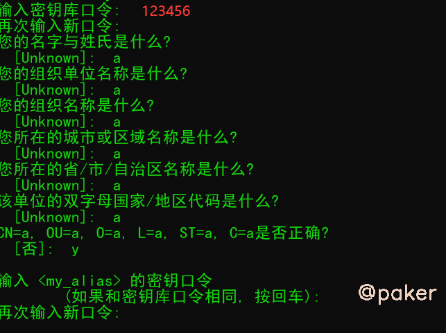

tags: spider android逆向
date: 2021年8月26日
title: apktool修改重打包签名某快乐app
private: false

# apktool修改重打包签名某快乐app

修改某快乐app（hxiuc）代码，重新打包签名，实现无限试看

## 1.ds需求

明明是快乐app，只能免费试看三次，瞬间不快乐了

## 2.反编译、修改代码、重打包

运行命令

> apktook d hxc_ori.apk

会在当前文件夹下生成hxc_ori这样一个文件夹，里面是解包后的资源文件与smali代码，内部是这个样子的

全局搜索 **“试看次数”**，搜索结果零条。明明有 “试看次数超限” 的提示，代码里为什么搜不到？

再次尝试，将中文转为Unicode编码试一试，即 **“\u8bd5\u770b\u6b21\u6570”**

很明显了，将3改成100000，保存即可。

重新打包，运行命令

> apktool b ./hxc_ori

会在 .\hxc_ori\dist下生成重新打包后的hxc_ori.apk文件

## 3.签名

未签名APK不能在安卓手机上安装，keytool jarsigner 工具是JAVA JDK自带的

**生成证书**，在dist文件夹下运行命令

> keytool -genkey -keystore my-release-key.keystore -alias my_alias -keyalg RSA -keysize 4096 -validity 10000

口令随便输入个123456就行，最后会生成 my-release-key.keystore文件

**用证书给apk签名**

> jarsigner -sigalg MD5withRSA -digestalg SHA1 -keystore my-release-key.keystore -signedjar hxc_ori_sign.apk hxc_ori.apk my_alias

运行命令，输入上边的密钥口令123456

大功告成，生成的hxc_ori_sign.apk就是重打包并且已经签名的apk，可以在手机上安装，快乐去了!