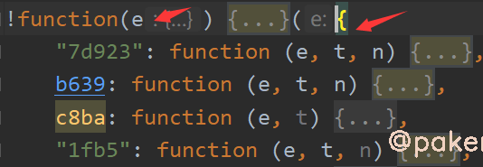
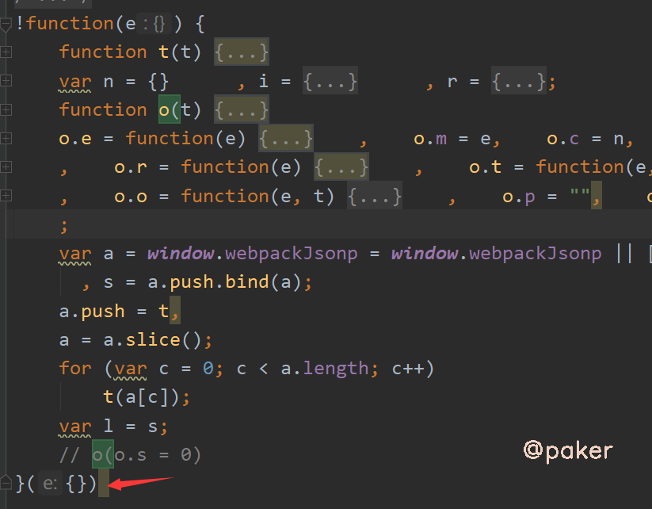
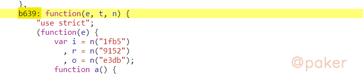
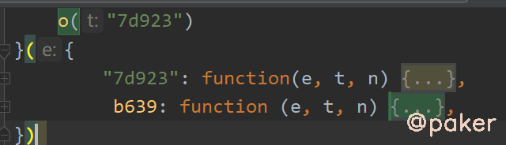
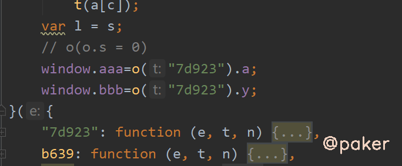

tags: spider js逆向
date: 2021年8月29日
title: js逆向webpack国家医保服务平台
private: false

# js逆向webpack国家医保服务平台

遇到webpack别懵，一般来说难度低于其他的js加密，了解了webpack的结构样式，扣起来就是缺啥方法直接复制粘贴即可。

本文以国家医保服务平台为例，记录下js webpack的逆向思路与方法。网站地址(base64)：

> aHR0cHM6Ly9mdXd1Lm5oc2EuZ292LmNuL25hdGlvbmFsSGFsbFN0LyMvc2VhcmNoL21lZGljYWw=

## 1.抓包&定位


好家伙，header，post data里面均有加密的参数，如**x-tif-nonce**，**x-tif-signature**，**signData**等

看signData顺眼，全局搜索一下。很快，一下子定位到app js中，header和post data参数加密逻辑在一起，幸福啊！


## 2.先了解下webpack的基本结构

Webpack 是一个前端资源加载/**打包**工具。它将根据模块的依赖关系进行静态分析，然后将这些模块按照指定的规则生成对应的静态资源。

整体上看是一个自执行函数，传入的参数一般为object或者数组（内容都是function定义的一个一个方法）



必不可少的加载器，关键字exports，一般长这样

```js
    function o(t) {
        if (n[t])
            return n[t].exports;
        var i = n[t] = {
            i: t,
            l: !1,
            exports: {}
        };
        return e[t].call(i.exports, i, i.exports, o),
        i.l = !0,
        i.exports
    }
```

## 3.webpack扣取技巧

可以看下我们第一步定位的加密参数生成的app js有多大，7万多行，到时候比较一下抠出来后会有多少行（结论8千多行）


先去掉这个自执行函数的参数，复制到本地，大概这样



第一步定位到的加密参数生成位置 e.data.signData = p(e)，是在7d923方法里


把7d923复制到自执行方法的参数中去


不可能就这么简单，运行会报错，Cannot read property 'call' of undefined


我们在报错那行，打印下


输出b639，也就是这个方法为undefined，去app js里面复制下来



添加到自执行方法的参数里



重复操作即可，最后把自执行方法里，我们要调用的方法暴露给全局即可



这里的window.aaa和window.bbb分别为

> 请求参数加密 ：
>
> 根据请求参数signData去全局搜索，发现是webpack打包的js
>
> 请求返回的结果需要解密：
>
> 根据响应返回的数据，全局搜索 encData 定位到 var n = e.from(t.data.data.encData, "hex")