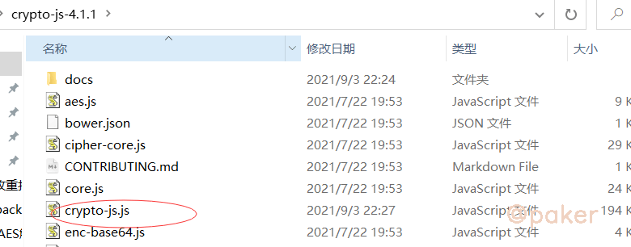

tags: spider js逆向
date: 2021年9月4日
title: 四库一平台AES解密&crypto-js的使用
private: false

# 四库一平台AES解密&crypto-js的使用

crypto-js是个很流行的js加密算法库，以四库一平台的响应数据AES解密为例，记录下crypto-js的使用

目标网址

> ```
> aHR0cDovL2p6c2MubW9odXJkLmdvdi5jbi9zdXBlcnZpc2UvbGlzdA==
> ```

## 1.定位解密位置

首先看下接口返回的数据，一串密文

> ```
> 95780ba0943730051dccb5fe3918f9fe4c6612ab。。。
> ```

没办法通过全局搜索的方式定位，那么先下个xhr断点 api/webApi/artcleApi/getPageList

按照正常的逻辑分析，接口响应的密文数据肯定会被前端js再处理解密，最终渲染到网页上显示出正常数据

随便找了一段正向开发的js请求代码，先学习一下：

XMLHttpRequest.onreadystatechange = callback；当 readyState 的值改变的时候，callback 函数会被调用。

```javascript
var xhr= new XMLHttpRequest(),
 method = "GET",
 url = "https://developer.mozilla.org/";

xhr.open(method, url, true);
xhr.onreadystatechange = function () {
if(xhr.readyState === XMLHttpRequest.DONE && xhr.status === 200) {
 console.log(xhr.responseText) //打印响应内容
}
}
xhr.send();
```

按照这个思路，我们在xhr断点断住的时候去寻找 onreadystatechange

```javascript
d.onreadystatechange = function() {
                 if (d && 4 === d.readyState && (0 !== d.status
```

跟进，最终定位到解密函数的位置

```javascript
function h(t) {
 var e = d.a.enc.Hex.parse(t)
   , n = d.a.enc.Base64.stringify(e)
   , a = d.a.AES.decrypt(n, f, {
```

采用AES解密，可以用python实现，或者使用今天推荐的crypto-js这个js加密算法库

## 2.crypto-js的使用

crypto-js，github地址：https://github.com/brix/crypto-js

**方式一、npm安装**

> ```
> npm install crypto-js
> ```

*典型API调用签名用例的ES6导入：*

```
import sha256 from 'crypto-js/sha256';
import hmacSHA512 from 'crypto-js/hmac-sha512';
import Base64 from 'crypto-js/enc-base64';

const message, nonce, path, privateKey; // ...
const hashDigest = sha256(nonce + message);
const hmacDigest = Base64.stringify(hmacSHA512(path + hashDigest, privateKey));
```

*模块化包括：*

```
var AES = require("crypto-js/aes");
var SHA256 = require("crypto-js/sha256");
...
console.log(SHA256("Message"));
```

*包括所有库，用于访问其他方法*：(就是全部加密算法一起引入)

```
var CryptoJS = require("crypto-js");
console.log(CryptoJS.HmacSHA1("Message", "Key"));
```

**方式二、直接导出文件使用**

在官方项目地址里，下载：https://github.com/brix/crypto-js/releases



把crypto-js.js，稍作修改(就是把原代码的头部稍微修改了下)，就可以直接使用了，代码如下

```javascript
var CryptoJS = new CryptoJS();
function CryptoJS(){

	/*globals window, global, require*/

	/**
	 * CryptoJS core components.
	 */

	var CryptoJS = CryptoJS || (function (Math, undefined) {
	省略。。。
	省略。。。
	省略。。。
	C.RabbitLegacy = StreamCipher._createHelper(RabbitLegacy);
	}());


	return CryptoJS;

};
```

## 3.web端解密实现

```javascript
function mainfunc(t) {
    var f = CryptoJS.enc.Utf8.parse("jo8j9wGw%6H***");
    var m = CryptoJS.enc.Utf8.parse("0123456789****");
    var e = CryptoJS.enc.Hex.parse(t)
      , n = CryptoJS.enc.Base64.stringify(e)
      , a = CryptoJS.AES.decrypt(n, f, {
        iv: m,
        mode: CryptoJS.mode.CBC,
        padding: CryptoJS.pad.Pkcs7
    })
      , r = a.toString(CryptoJS.enc.Utf8);
    return r.toString()
}
```

## 4.小程序端解密实现

当你以为小程序和web端用了一套加解密方法时，你就错了，需要反编译小程序，直接搜索.pad.Pkcs7定位，最终的解密方法为

```javascript
var r = CryptoJS.enc.Hex.parse("cd3b2e6d63473c******");
function deCrypt(t) {
    var d = CryptoJS.AES.decrypt(t, r, {
        mode: CryptoJS.mode.ECB,
        padding: CryptoJS.pad.Pkcs7
    });
    return JSON.parse(CryptoJS.enc.Utf8.stringify(d));
};
```

