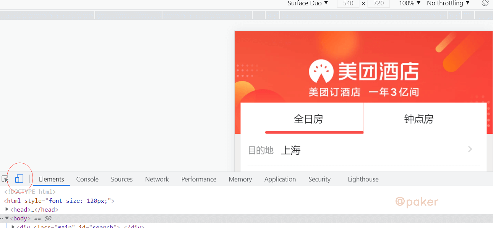
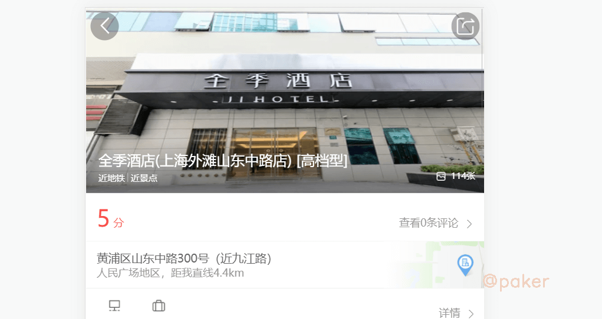
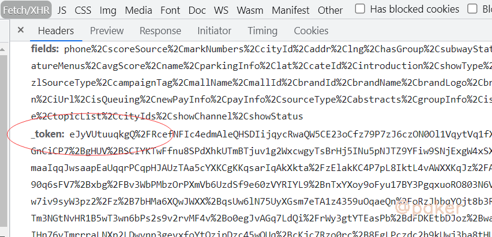
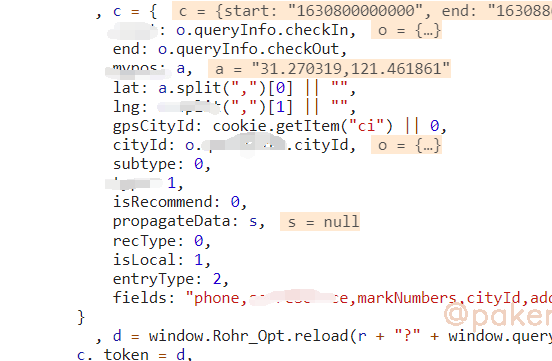
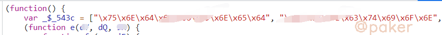
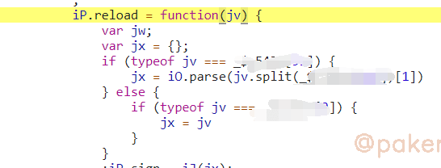
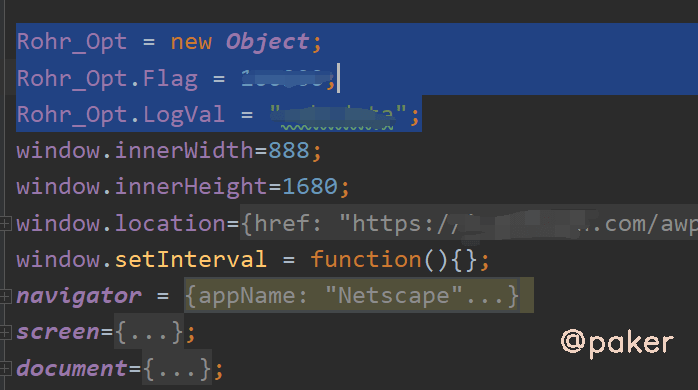
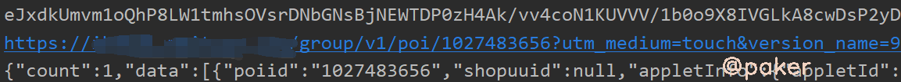

tags: spider js逆向
date: 2021年9月5日
title: 某团H5 _token参数
private: false

# 某团H5 _token参数

以某团酒店详细信息为例，记录下_token参数的破解过程，_token生成方法应该是全站通用的

## 1.目标网站

地址：

> aHR0cHM6Ly9pLm1laXR1YW4uY29tL2F3cC9oNS9ob3RlbC9zZWFyY2gvc2VhcmNoLmh0bWw=

红色圈出来的位置，开启就会显示h5界面了。

因为酒店这个板块，_token出现在酒店详细信息页面，自己随便搜索一个五星高档酒店吧

## 2._token加密位置

首先，_token长这样

先下个xhr断点，group/v1/poi/酒店id

刷新页面，当断点断住时，查看堆栈调用，定位到这

> getPoi: function(t, e) {

看下这个方法里做了什么

c = {}构造了请求需要的参数，_token = d = window.Rohr_Opt.reload(参数是请求url)

window.Rohr_Opt.reload，就是加密方法了

## 3.扣代码，补环境

进入window.Rohr_Opt.reload

头部

reload方法位置

方法导出到全局，也就是为什么我们能直接通过window.Rohr_Opt.reload调用

这个js文件直接复制到本地即可

直接运行会报错和卡住，需要补环境和去掉setInterval

最后看下生成的_toekn，可以使用

