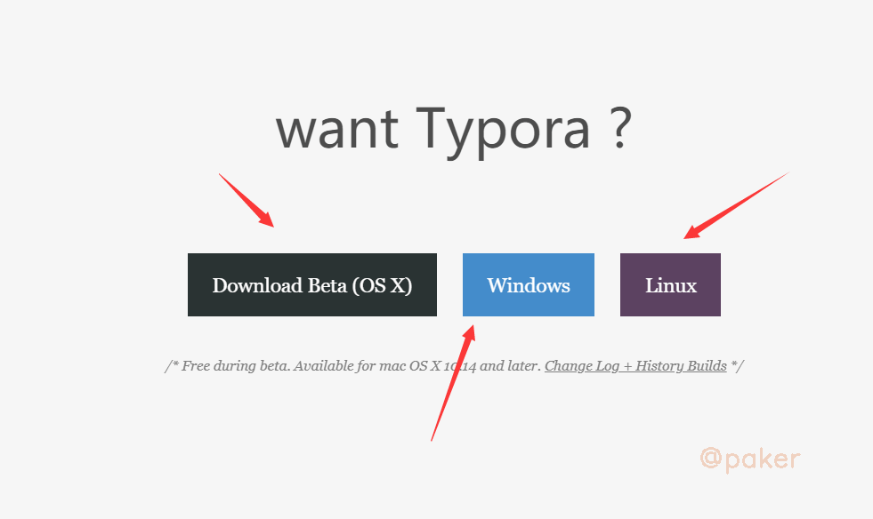
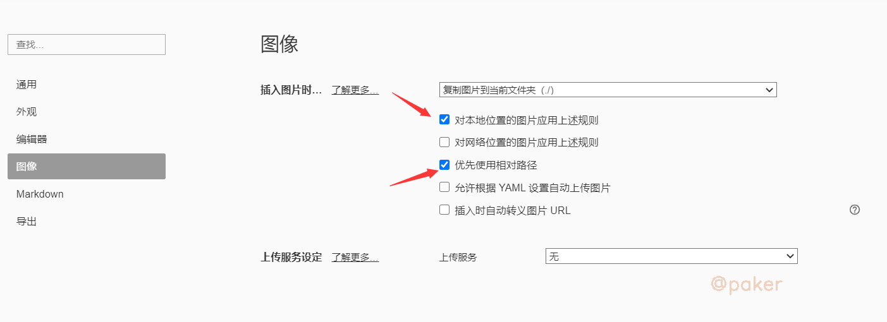

tags: typora markdown
date: 2021年7月30日
title: markdown编写神器Typora
private: False

# markdown编写神器Typora

小白不会markdown语法怎么办？推荐这款简单易上手的神器Typora

## 1.下载安装

官方下载地址 https://www.typora.io/ ，支持windows, macos, linux

## 2.基本使用

软件下一步下一步安装后，打开，就是这样一个纯净的界面，看起来就很舒服

不会快捷键，不会markdown语法没关系，只要你会鼠标右键就行

鼠标右键常用的功能：

- 段落-》一级标题 二级标题（默认编辑文字就是段落）
- 插入-》代码块 脚注 表格等等
- 图片可以直接复制粘贴到文章里

## 3.常用设置

点击 文件-》偏好设置 进入到设置页面

强烈建议图像选项这么设置

