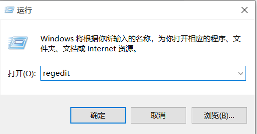
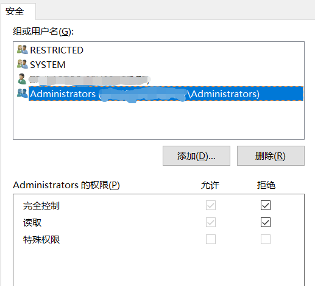
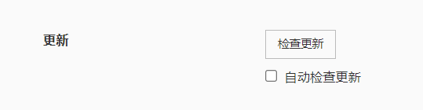

tags: typora markdown
date: 2022年10月3日
title: Typora免费版延长使用
private: False

# Typora免费版延长使用

之前使用的Typora 免费版本0.11.18，最近一看，打开就弹窗强制升级。

> The beta version of typora is expired, please download and install a newer version.

## 解决方法：

windows + r键打开运行窗口，输入regedit，打开注册表。

依次展开计算机\HKEY_CURRENT_USER\SOFTWARE\Typora，然后在Typora上右键，点权限，选中Administrtors，把权限全部设置为拒绝。

最后打开Typora，关闭自动更新（文件->偏好设置->通用）

