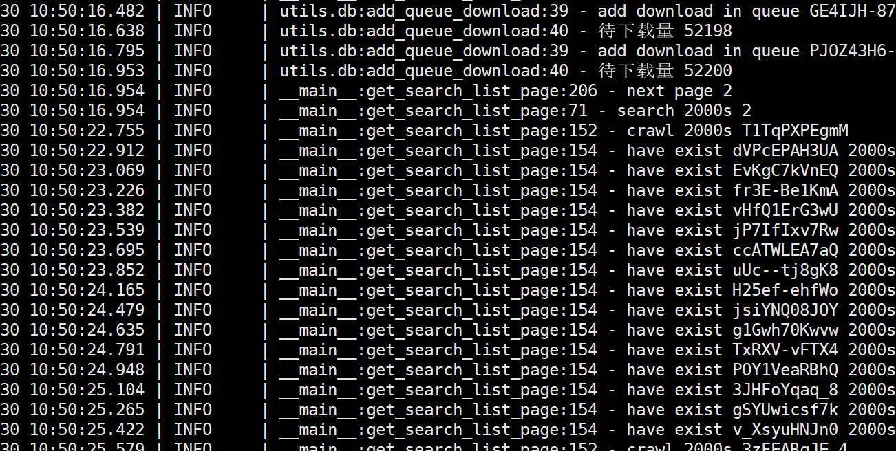

tags: blog markdown
date: 2022年9月29日
title: 测试文章
# inotify的使用教程
## 安装和基本使用

https://blog.csdn.net/qq_37788558/article/details/104985262





参数

| 序号 | 名称                   | 时间      |
| ---- | ---------------------- | --------- |
| 1    | 安康基本的框架八年级   | 2022.9.30 |
| 2    | 嗷嗷撸看你的来看       | 2022.9.30 |
| 3    | 阿德里克那点离开你来看 | 2022.9.30 |

重点：

- `-m` 默认情况下inotifywait发现一个事件就退出了。m可以持续观测并输出
- `-r` 递归观测目录
- `-q` 不输出乱七八糟的提示信息，这个在使用linux管道时候需要加上，否则管道后面会受到格式不可预测的文本输出
- `-d`, `-o` 作为后台进程运行，并且输出到一个文件里
- `-c` 输出格式为csv
- `-e` 对哪些事件感兴趣，列在后面，用逗号隔开。事件是预定义的。有哪些查一下本文后面的手册。
- `--timefmt` 定义一下命令最终输出内容里的时间格式
- `--format`这个地方定义了输出的格式，可以把 `--timefmt`里定义的时间使用`%T`包含进来输出。 **和-c参数为互斥**
  - `%w`  发生事件的目录
  - `%f` 触发事件的文件
  - `%e` 发生的事件
  - `%T` 发生的时间
  - `%Xe` 如果多个事件发生，用`X`分割


### 示例

```shell
inotifywait -m /path -e create -e moved_to |
    while read directory action file; do
        if [[ "$file" =~ .*xml$ ]]; then # Does the file end with .xml?
            echo "xml file" # If so, do your thing here!
        fi
    done
```


## 笔记

```python
$ inotifywait -mrq --timefmt "%y-%m-%d/%H:%M:%S" --format "%T '%w%f' %e" -e  CLOSE_WRITE   /home/smallfile/monitor_dir/
```

上述命令 `-m`让命令一直监控，除非被强制退出

`r` 监控子目录

`q` 不要输出无关提示信息，可以参考下面两段命令做个对比。

没有使用`-q`的时候：

```shell
[~smallfile]$ inotifywait -mr --timefmt "%y-%m-%d/%H:%M" --format "%T '%w%f' %e" -e  CLOSE_WRITE   /home/smallfile/monitor_dir/
Setting up watches.  Beware: since -r was given, this may take a while!
Watches established.
22-08-06/14:51 '/home/smallfile/monitor_dir/a.txt' CLOSE_WRITE,CLOSE
22-08-06/14:51 '/home/smallfile/monitor_dir/a' CLOSE_WRITE,CLOSE
22-08-06/14:51 '/home/smallfile/monitor_dir/b' CLOSE_WRITE,CLOSE
22-08-06/14:51 '/home/smallfile/monitor_dir/c' CLOSE_WRITE,CLOSE
22-08-06/14:51 '/home/smallfile/monitor_dir/d' CLOSE_WRITE,CLOS
```

使用了`-q`之后

```shell
[~smallfile]$ inotifywait -mr --timefmt "%y-%m-%d/%H:%M" --format "%T '%w%f' %e" -e  CLOSE_WRITE   /home/smallfile/monitor_dir/
22-08-06/14:51 '/home/smallfile/monitor_dir/a.txt' CLOSE_WRITE,CLOSE
22-08-06/14:51 '/home/smallfile/monitor_dir/a' CLOSE_WRITE,CLOSE
22-08-06/14:51 '/home/smallfile/monitor_dir/b' CLOSE_WRITE,CLOSE
22-08-06/14:51 '/home/smallfile/monitor_dir/c' CLOSE_WRITE,CLOSE
22-08-06/14:51 '/home/smallfile/monitor_dir/d' CLOSE_WRITE,CLOS
```


### 示例

```shell
inotifywait -mrqc   -e  CLOSE_WRITE   /home/smallfile/monitor_dir/ | while read info; do echo ${info};done

#最后我用了一个方法，可以控制并发：
inotifywait -mrqc   -e  CLOSE_WRITE   /home/smallfile/monitor_dir/  | xargs -I% -P5 ./exe.sh %   #其中exe.sh是一个脚本，执行文件的copy的工作。

inotifywait -mrqc   -e  CLOSE_WRITE   /home/smallfile/monitor_dir/  | parallel --jobs 3 ./exe.sh {%}  {1}
```


## 参考

- 很短小清晰的一个文章 https://wangchujiang.com/linux-command/c/inotifywait.html
- 参考文章也不错 https://blog.csdn.net/qq_37788558/article/details/104985262

- 命令手册 https://linux.die.net/man/1/inotifywait
- 观察一个文件创建，并设置一个写入超时时间，返回这个文件 
https://stackoverflow.com/questions/70132359/how-t
o-use-inotifywait-to-wait-till-a-file-is-created-and-is-written-content-wit
- 观测文件/目录并根据后缀等包含特定文件、排除特定文件 
https://unix.stackexchange.com/questions/
323901/how-
to-use-inotifywait-to-watch-a-directory-for-crea
tion-of-files-of-a-specific


## inotifywait替代品

- JAVA 实现 http://jnotify.sourceforge.net/  定义的事件非常有限，只有 create\modify\rename\delete
- python实现 https://github.com/dsoprea/PyInotify