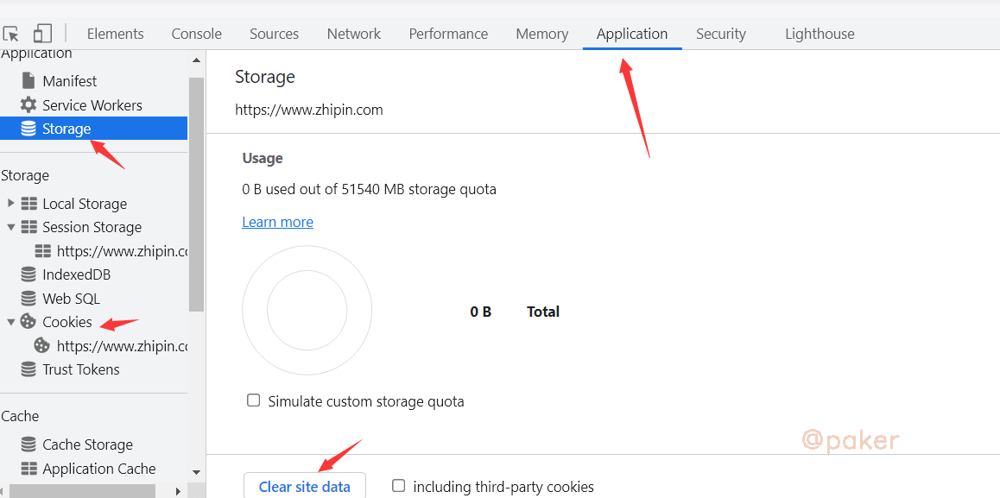
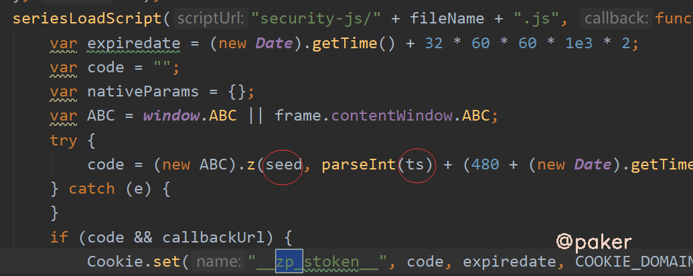
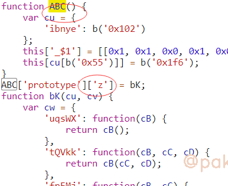
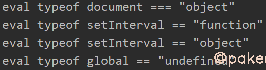
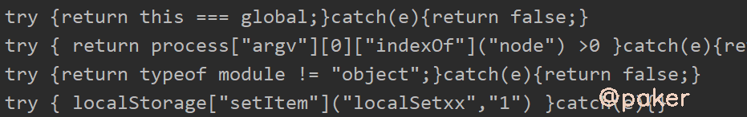
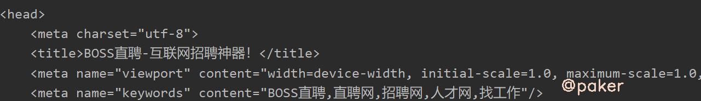
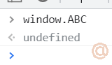

tags: spider js逆向
date: 2021年9月14日
title: Boss某聘zp_token时好时坏？
private: false

# Boss某聘zp_token时好时坏？

boss某聘必带的cookie参数__zp_stoken__，发现了一些好玩的检测，以及为什么本地生成的zp_token一会可以用，一会不好用

目标地址：

> aHR0cHM6Ly93d3cuemhpcGluLmNvbS9qb2JfZGV0YWlsLz9xdWVyeT1qYXZh

## 1.抓包

可以先清除下缓存和cookie



重新访问，使用fiddler抓包


cookie生成的大概流程，不带cookie时会302重定向security-check.html，加载了security-js js文件，生成cookie，最终访问200成功

## 2.定位

在security-check.html的script标签里有这样一段代码，seed和ts来自security-check.html这个请求的url参数，zp_token = (new ABC).z(seed,***)

ABC定义的位置在security-js js文件



## 3.扣代码补环境
首先看看security-js里面什么样，混淆了。。。

但是，目标方法(new ABC).z 很明确



**如何补环境？**

1. js Proxy先初步打印出一些环境，如window，document，navigator，location，screen，history等
2. 本地node环境和浏览器环境同时运行，插桩打印关键位置的变量参数，值等，相互对比哪一块的值不一样下断点进一步分析，最终两边的输出一模一样，可以认为本地环境模拟的、伪造的完美(可能有一丢丢不一样不影响，也可能就是这一丢丢不一样导致你被检测识别)

***部分**检测的环境*（完整的就不写了，都是通过proxy和hook脚本找到的）

> //浏览器
>
> window.top
>
> OfflineAudioContext
>
> history
>
> navigator
>
> location
>
> document
>
> canvas
>
> outerHeight、innerHeight、outerWidth、innerWidth
>
> localStorage、sessionStorage
>
> atob方法
>
> //检测node环境
>
> process
>
> global

比如检测了process，可以直接delete process

有意思的检测，通过eval和new Function去执行一些字符串语句

应对方法也很简单，hook一下就原形毕露

**eval**

```javascript
var eval_ = window.eval;
window.eval = function(x){
    console.log("eval",x)
    eval_(x);
};
```



**new Function**

```javascript
Function = new Proxy(Function, {
    construct: function (T, L, N) {
        if (typeof L[0] == 'string') {
            console.log(L[0])
        }
        return Reflect.construct(T, L, N)
    }
})
```



## 4.验证zp_token是否一直好用



测试一直好用。当你生成的zp_token时而好用时而不好用，回头细心点补环境找检测吧。

## 5.Tips

使用rpc调用的话就太简单了，当然也有坑

直接window.ABC是找不到的



要使用window[0].ABC

