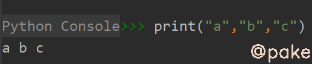
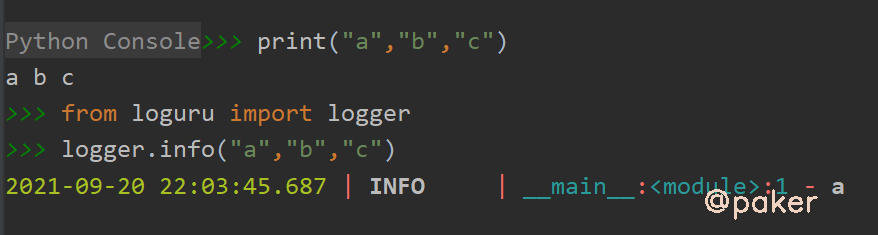

tags: python
date: 2021年9月20日
title: python hook实现loguru逗号拼接打印
private: false

# python hook实现loguru逗号拼接打印

在python中使用loguru打印时，无法像print(a,b,c)那样输出一行a b c，本文对loguru进行hook修改来实现同样的语法。

## 1.print与loguru对比

**print打印“a” "b" "c"**

> print("a","b","c")

输出



**loguru能不能使用同样的方式打印呢？**

> from loguru import logger
>
> logger.info("a","b","c")

输出



**只能输出a,b和c不见了**，说明logger.info不支持逗号分隔最后拼接成一行输出

## 2.hook方式修改loguru

首先要定位修改的方法位置

通过logger.info定位到loguru/_logger.py下的info方法，最终调用了__self.\_log方法


查看__self.\_log方法做了什么

> def _log(self, level_id, static_level_no, from_decorator, options, message, args, kwargs):
>
> ​	...
>
> ​	...
>
> ​	"message": str(message)
>
> ​	args = [arg() for arg in args]
>
> ​	kwargs = {key: value() for key, value in kwargs.items()}
>
> ​	elif args or kwargs:
>
> ​		log_record["message"] = message.format(*args, **kwargs)

从这行args or kwargs，分析args和kwargs只要有一个存在就行

改写思路是，忽略args的作用，默认只使用kwargs来做一些设置，将args转成str拼接成message打印

稍微封装了一下的代码如下：

```python
# -*- coding: UTF-8 -*-
# @Time : 2021/9/18 10:22
# @Author : zp

from loguru import logger as logclass

class Logging(object):
    def __init__(self):
        self.logtool = logclass
        # 这是hook啊
        ori_log = logclass._log
        def selflog(level_id, static_level_no, from_decorator, options, message, args, kwargs):
            args = [str(arg) for arg in args]
            if args:
                message = str(message) + ' ' + ' '.join(args)
            ori_log(level_id, static_level_no, from_decorator, options, message, None, kwargs)

        self.logtool._log = selflog

if __name__ == '__main__':
    logger = Logging().logtool
    logger.add('test2.log')
    # print可以逗号输出
    print('a', 'b', 'c')
    # logger不可以逗号输出,只会输出第一个
    logger.info('a', 'b', 'c')
    logger.info({"a": 123, '3': "adasda"}, [1, 2, 3, 4], "你好啊")
    logger.info("this is test", Exception, logger)
```

输出如下：


**注意！！！纯属个人娱乐，未经过生产验证！！！**