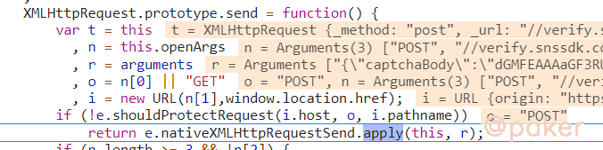
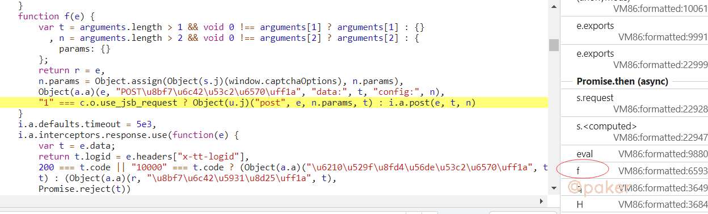
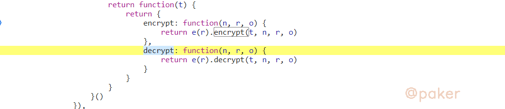
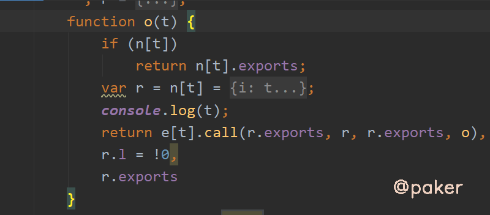
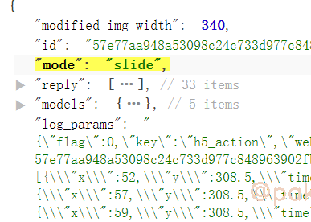
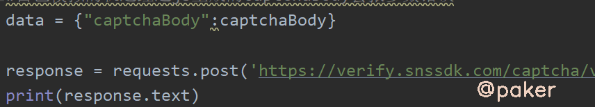
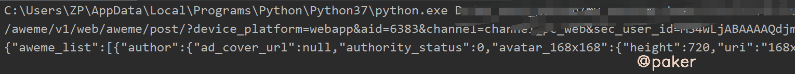

tags: spider js逆向
date: 2021年9月28日
title: 某音滑块验证码captchaBody
private: false

# 某音滑块验证码captchaBody

记录下某音滑块captchaBody参数生成位置以及简单模拟轨迹，最终激活cookie s_v_web_id，实现大V主页请求。

网站地址：

> aHR0cHM6Ly93d3cuZG91eWluLmNvbS91c2VyL01TNHdMakFCQUFBQVFkam1BSk1hQTE5LVVJWXloY2YweHRFR0tLZkluR3JjWTAzRVRCX01mWkU=

## 1.抓包分析

不得不说宇宙厂更新的速度也太快了(不是已经取消大小周了吗？)，从6月某音web版上线至九月，经历了_signature校验，_signature检测加强，滑块，某些接口必须携带滑块激活过的cookie...从单纯的jsvmp到现在的jsvmp+ob混淆。

访问大V主页数据接口时，经测试，滑动滑块激活过后的cookie s_v_web_id必不可少（_signature msToken X-Bogus不携带也能请求到数据）

> aweme/v1/web/aweme/post/?device_platform=webapp&aid=6383&channel=channel_pc_web&sec_user_id=

**先看看滑块verify的参数**，多抓包几次发现，**captchaBody**是变化的


## 2.定位

先打上xhr断点，熟悉的位置

> verify.snssdk.com/captcha/verify?lang=zh&app_name



堆栈调用，往前翻翻，从这里发起的post请求（整个代码来自captcha.js，只不过运行时加载到了VM里）



加密首先想到关键字encrypt（对应的解密首先想到decrypt）,就在当前这段js里搜索“encrypt”



下断点，重新滑动，堆栈调用，往前翻翻。arguments这不就是滑动的轨迹参数吗


整段js，发现是webpack结构的，encrypt导出声明的位置在这


最终目的就是调用l.encrypt({轨迹},"Base64")

## 3.扣代码&补环境

因为是webpack打包的js，怎么把主动调用encrypt这部分抠出来呢？用哪种方式都行

1.简单无脑扣(缺啥补啥)

2.找到切入点，webpack半自吐(可参考：https://mp.weixin.qq.com/s/HkRH0YxS4YUgdpu7vvmGQA)

由于整个自执行函数传入的参数不是object而是数组


使用缺啥补啥的方法时不好定位缺少那个方法，我们先转成object

```javascript
var funce = [...]//图片里的数组
for(var i = 0; i < funce.length; i++) {
	funce_str = i+":"+funce[i].toString();
    console.log(funce_str)
    //定位主动调用的encrypt是哪个方法，是37号方法
	//if (funce_str.indexOf('l.enc')!=-1){
	//    console.log(funce_str)
    //}
}
```

在构造器处打印调用了几号方法



先将37号方法当作参数传入，报错少几号方法就补几号方法


如下，报错缺失缺少34号方法，一点点补上就完事了


不要疑惑，补完确实好多方法


**补环境同步进行**

挂上proxy，缺失什么浏览器环境就补上，避免进入错误的分支。可以把_signature那套环境拿过来用，再加上atob和btoa两个base64方法

## 4.轨迹模拟



reply我算是距离初始点x和y和时间的差值，models我算是当前点的x和y坐标和时间的值

## 5.看效果



结果


用激活过的cookie s_v_web_id即验证码verify的fp参数，去请求大V数据，success！


