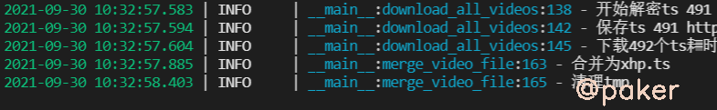

tags: python
date: 2021年9月30日
title: 开箱即用的m3u8下载器
private: false

# 开箱即用的m3u8下载器

越来越多的视频网站采用*HLS*(基于HTTP的自适应码率流媒体传输协议)视频流加载和播放视频资源，包括一个m3u8的索引文件，TS媒体分片文件和key加密串文件(不一定全有)，以前打开network-media就能找到.mp4下载链接的日子一去不复返。从零开发一个m3u8通用下载器，满足动漫和小h片的下载需求。

项目地址：https://github.com/sixgad/m3u8download

## 1.m3u8文件格式分析

大致分成三种情况

一、普通无加密

```
#EXTM3U
#EXT-X-VERSION:3
#EXT-X-MEDIA-SEQUENCE:0
#EXT-X-ALLOW-CACHE:YES
#EXT-X-TARGETDURATION:17
#EXTINF:10.083333,
http://aaa.com/0000.ts
```

二、包含ts文件加密key(标准AES加解密)

```
#EXTM3U
#EXT-X-VERSION:3
#EXT-X-TARGETDURATION:6
#EXT-X-PLAYLIST-TYPE:VOD
#EXT-X-MEDIA-SEQUENCE:0
#EXT-X-KEY:METHOD=AES-128,URI="ts4.ttt.com:9999/20210617/DmV0P4zD/1000kb/hls/key.key"
#EXTINF:3.127,
ttt.ttt.com:9999/20210617/DmV0P4zD/1000kb/hls/m0eBxHTh.ts
```

```
有时候m3u8文件里可能包含多个分辨率连接 比如720x480、1080x720
#EXTM3U
#EXT-X-STREAM-INF:PROGRAM-ID=1,BANDWIDTH=1000000,RESOLUTION=720x480
1000kb/hls/index.m3u8
```

三、特殊的

> 1.m3u8文件被加密
>
> 2.很多视频网站为了保护自己的TS视频文件，在网络传输AES密钥的过程中，都对该密钥做了处理。
> 比如阿里云大学的TS视频AES密钥做了位运算处理。牛客网的TS视频AES密钥在发送前被AES加密了一遍

## 2.从零开发，部分代码

```python
class M3u8VideoDownloader():
    def __init__(self, m3u8_url, download_path='video', video_name='xhp', is_del_clip=True,
                 dec_func=None, m3u8_content_plaintext=None):
        """
        :param m3u8_url: m3u8链接
        :param download_path: 下载路径
        :param video_name: 视频名称（不能出现括号）
        :param is_del_clip: 合并视频完成后是否删除ts文件
        :param dec_func: m3u8内容解密函数（内容被加密时可传入解密函数，或直接将解密后的明文内容传递给参数m3u8_content_plaintext）
        :param m3u8_content_plaintext: 已解密的m3u8明文内容
        :param cache_path:默认ts下载目录
        """
        self.m3u8_url = m3u8_url
        self.download_path = download_path
        self.video_name = video_name
        self.is_del_clip = is_del_clip
        self.dec_func = dec_func
        self.m3u8_content_plaintext=m3u8_content_plaintext
        self.video_name_suffix = '.ts'
        self.cache_path = os.path.join(self.download_path, 'tmp')
        self.key_url = None
        self.key = None
        self.iv = None
        self.decipher = None
        self.ts_list = []
```

完整项目地址：https://github.com/sixgad/m3u8download

## 3.演示

拉取代码

> git clone https://github.com/sixgad/m3u8download.git

安装依赖包

> pip install -r requirements.txt

修改download.py中待下载视频的m3u8链接

>  m3u8_url = "***"
>
>   tool = M3u8VideoDownloader(m3u8_url=m3u8_url)
>
>   tool.start()

运行

> python download.py

结果



视频默认保存在video下，那个大的ts文件就是合并之后的视频，可直接播放（也可使用ffmpeg将视频格式ts转mp4）