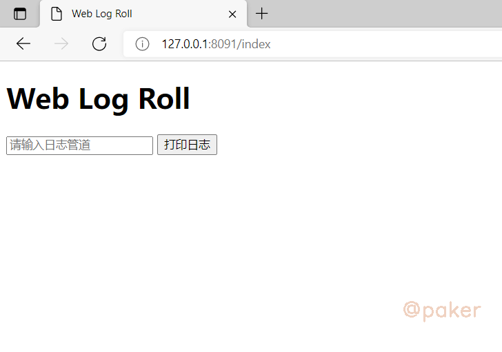
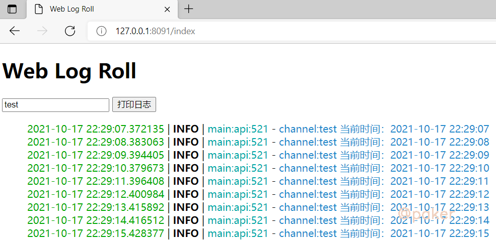

tags: python
date: 2021年10月17日
title: Server-Sent Events实现实时日志查看器
private: false

# Server-Sent Events实现实时日志查看器

SSE(Server-sent events)：服务器发送事件。是基于http协议，和WebSocket的全双工通道（web端和服务端相互通信）相比，SSE只是单通道（服务端主动推送数据到web端），但正是由于此特性，在不需要客户端频繁发送消息给服务端，客户端却需要实时或频繁显示服务端数据的业务场景中可以使用。

项目地址：https://github.com/sixgad/sse-sanic-log

## 1.开发背景

起因是因为看到了这个项目，Dozzle，https://github.com/amir20/dozzle

> Dozzle 是一个小型轻量级应用程序，具有基于 Web 的界面来监控 Docker 日志。它不存储任何日志文件。它仅用于实时监控您的容器日志。

使用发现，展示日志网页 header "Content-Type" 为 "text/event-stream"，进而简单开发一套自己的实时日志查看器。

## 2.client

```javascript
    function pprint() {
        var source = new EventSource("/message?channel="+document.getElementById('message').value);
        source.addEventListener('message', function (event) {
            var data = JSON.parse(event.data);
            //console.log(data)
            var logtext = preparedata(data.info)
            $('#get_message').append(logtext);
        }, false);
        source.addEventListener('error', function (event) {
            console.log('reconnected service!')
        }, false);
    }
```


## 3.server
重点部分来了，python 实现 SSE server，基于Sanic实现

```python
@app.route('/message')
async def message(request):
    channel = request.args.get("channel",'log')
    async def sample_streaming_fn(response):
            id = 0
            while True:
                id += 1
                await response.write('id: {}\nevent: message\ndata: {}\n\n'.format(id, await get_message(channel)))
    return response.stream(sample_streaming_fn, content_type='text/event-stream')
```

目前sanic也有现成的第三方包支持，如sanic-sse，https://pypi.org/project/sanic-sse/

## 4.使用与展示

项目地址：https://github.com/sixgad/sse-sanic-log

拉取项目代码

> git clone git@github.com:sixgad/sse-sanic-log.git

安装依赖包

> pip install -r requirements.txt

运行

> python run.py

访问 127.0.0.1:8091/index



点击打印日志按钮即可

