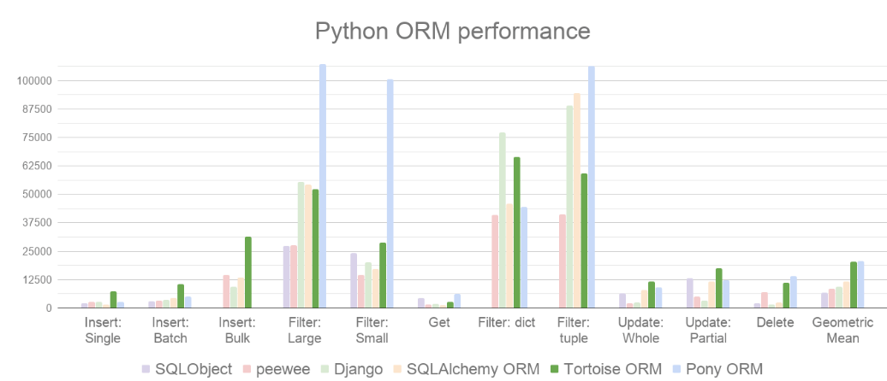

tags: python
date: 2021年11月8日
title: Tortoise ORM一个易用高效的asyncio ORM
private: false

### Tortoise ORM一个易用高效的asyncio ORM

Python有许多现有的和成熟的ORM，不幸的是，它们的设计与I/O的处理方式相反。asyncio是一种相对较新的技术，具有不同的并发模型，最大的变化是关于如何处理I/O。Tortoise ORM的设计既实用又熟悉，以希望简化切换到`asyncio`。

与其他 Python ORM 相比，它也表现良好。



官方项目地址：https://github.com/tortoise/tortoise-orm/

官方文档地址：https://tortoise-orm.readthedocs.io/en/latest/

**Tortoise ORM** 目前支持以下数据库：

- PostgreSQL >= 9.4（使用`asyncpg`）
- SQLite（使用`aiosqlite`）
- MySQL/MariaDB（使用aiomysql或使用asyncmy）

## 1.简单使用

以操作sqlite数据库为例

首先，您必须像这样安装Tortoise ORM：

> pip install tortoise-orm

定义你的模型models.py：

```python
from tortoise.models import Model
from tortoise import fields

class Blog(Model):
    """
    博客文章表
    """
    id = fields.IntField(pk=True)
    title = fields.CharField(max_length=500)
    url = fields.CharField(max_length=300)
    content = fields.TextField()
    views = fields.IntField(default=0)
    class Meta:
        table = "blog"
```

初始化你的模型和数据库test.py：

```python
from models import Blog
from tortoise import Tortoise, run_async

async def init():
    await Tortoise.init(
        db_url='sqlite://db.sqlite3',
        modules={'models': ['models']}#models.py位置
    )
    # 建表,只运行一次即可，后边注释掉
    await Tortoise.generate_schemas()
    # 增删改查
run_async(init())
```

## 2.增删改查

代码放到上文test.py ”**#增删改查**“ 处即可运行

**增**

```python
# 新增一篇博客文章
insert_data = {
        "title": "测试title1",
        "url": "https://www.baidu.com",
        "content": "正文开始1"
        }
bg = Blog(**insert_data)
await bg.save()
```

**删**

```python
# 删除id=1的文章
await Blog.filter(id=1).delete()
```

**改**

```python
# 修改id为1文章的title,views
insert_data = {
    	"id":1,
        "title": "修改title1",
        "url": "https://www.baidu.com",
        "content": "正文开始1",
    	"views":666
        }
bg = Blog(**insert_data)
# 当待修改部分的主键为空时，不会执行新增操作，报错
await bg.save(force_update=True)
# 或者用update_fields,当数据内容主键为空时，下边方法会插入，当主键不为空时会修改
# await bg.save(update_fields=insert_data.keys())
```

**查**

```python
# 查询所有文章
await Blog.all().values()#values()返回一个list,[{"id":1},{"id":2}]

# 条件查询id=1的文章
await Blog.filter(id=1).values()

# 条件查询 title包含“python”的文章
await Blog.filter(title__contains="python").values()

# 条件查询 views>=10且<=1000的文章
await Blog.filter(views__gte = 10, views__lte = 1000).values()

# id 倒序
await Blog.all().order_by("-id")

# 分页
await Blog.all().order_by('-id').offset(int(page) * 20).limit(20).values()

# groupby
await Blog.annotate(sum=Sum(1)).filter(articleid__not='list').group_by("articleid").order_by('-sum').limit(3).values("articleid", "sum")
```


## 3.对于web开发框架的支持

对于Sanic、fastapi等有着很好的支持。

比如在Sanic中启用Tortoise ORM，so easy!

```python
from sanic import Sanic
from tortoise.contrib.sanic import register_tortoise
app = Sanic(__name__)
register_tortoise(
    app, db_url="sqlite://yourdb", modules={"models": ["models"]}, generate_schemas=True
)
```

