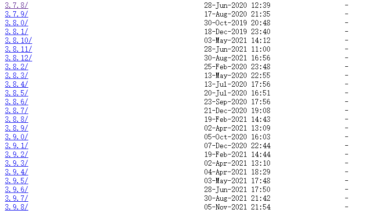

tags: linux
date: 2021年11月8日
title: Centos安装Python3.8
private: false

# Centos安装Python3.8

centos7下源码编译安装python3.8（3.7+版本均可），3.6可通过yum安装（yum install python36）略。。。

## 1.安装编译相关工具

准备工作，每台机器运行过一次即可

```shell
yum -y groupinstall "Development tools"
yum -y install zlib-devel bzip2-devel openssl-devel ncurses-devel sqlite-devel readline-devel
yum -y install libffi-devel tk-devel gdbm-devel db4-devel libpcap-devel xz-devel
```

## 2.下载python源码包

访问https://www.python.org/ftp/python/，就能看到各个版本的python包了



本文以**3.8.8**版本为例

```shell
# 下载
wget https://www.python.org/ftp/python/3.8.8/Python-3.8.8.tgz
# 解压
tar -zxvf  Python-3.8.8.tgz
```

## 3.编译安装

```shell
mkdir /usr/local/python3.8 #创建编译安装目录
cd Python-3.8.8
./configure --prefix=/usr/local/python3.8
make && make install
```

## 4.创建软连接

```shell
# python
ln -s /usr/local/python3.8/bin/python3.8 /usr/bin/python38
# pip
ln -s /usr/local/python3.8/bin/pip3.8 /usr/bin/pip38
```

## 5.使用

直接使用python38、pip38命令即可

