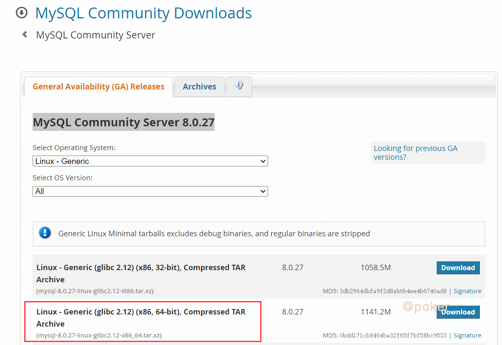
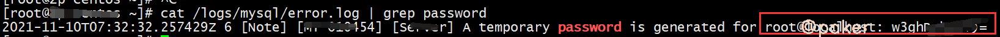

tags: linux
date: 2021年11月11日
title: Centos安装最新Mysql8
private: false

# Centos安装最新Mysql8

Centos7安装最新版本mysql，目前官网版本为MySQL Community Server 8.0.27

## 1.安装包下载&解压

访问官网地址：https://dev.mysql.com/downloads/mysql/

如下图勾选



linux下执行**下载**命令

> wget https://dev.mysql.com/get/Downloads/MySQL-8.0/mysql-8.0.27-linux-glibc2.12-x86_64.tar.xz

**解压**

> 解压
>
> xz -d mysql-8.0.27-linux-glibc2.12-x86_64.tar.xz
>
> tar xvf mysql-8.0.27-linux-glibc2.12-x86_64.tar
>
> 将解压后的文件移动到指定位置
>
> mv mysql-8.0.27-linux-glibc2.12-x86_64 /usr/local/mysql

## 2.创建软链接&添加服务

> 创建软连接
>
> ln -s /usr/local/mysql/bin/mysql /usr/bin/mysql
>
> ln -s /usr/local/mysql/bin/mysqldump /usr/bin/mysqldump
>
> 添加服务
>
> cp -a /usr/local/mysql/support-files/mysql.server /etc/init.d/mysql

## 3.添加用户组和用户
> groupadd mysql
>
> useradd -r -g mysql mysql

## 4.创建数据、日志、备份文件夹、修改权限

> mkdir -p /data/mysql /logs/mysql /bak/mysql
>
> chown -R mysql:mysql /usr/local/mysql/
>
> chown -R mysql:mysql /data/mysql/
>
> chown -R mysql:mysql /logs/mysql/
>
> chmod -R 777 /usr/local/mysql/
>
> chmod -R 777 /data/mysql/
>
> chmod -R 777 /logs/mysql/

## 5.编辑配置文件

默认配置文件位置，/etc/my.cnf

> vim /etc/my.cnf

写入如下配置

```
[mysqld]
basedir=/usr/local/mysql
datadir=/data/mysql
socket=/data/mysql/mysql.sock
log-error=/logs/mysql/error.log
port=3306
user=mysql
server-id=3306
symbolic-links=0
character-set-server=utf8mb4
lower_case_table_names = 1
collation-server=utf8mb4_general_ci
default-time-zone='+8:00'
 
max_connections=1000
max_connect_errors=10000
tmp_table_size=256M
max_heap_table_size=256M
 
log-bin=/data/mysql/mysql-bin
expire_logs_days=7
tmpdir=/tmp
 
# Disabling symbolic-links is recommended to prevent assorted security risks
# Settings user and group are ignored when systemd is used.
# If you need to run mysqld under a different user or group,
# customize your systemd unit file for mariadb according to the
# instructions in http://fedoraproject.org/wiki/Systemd
 
[mysqld_safe]
pid_file=/data/mysqld/mysqld.pid
log_error=/logs/mysql/error.log
 
#
# include all files from the config directory
#
[client]
socket=/data/mysql/mysql.sock
default-character-set=utf8mb4
```

## 6.初始化数据库

因为缺少组件报的错

> error while loading shared libraries: libnuma.so.1: cannot open shared object file: No such file or directory

解决办法

> yum -y install numactl.x86_64

初始化

> cd /usr/local/mysql/
>
> ./bin/mysqld --defaults-file=/etc/my.cnf --initialize

启动服务

> service mysql start

查看临时密码，保存好，很重要

> cat /logs/mysql/error.log | grep password



## 7.本地登录，修改密码

> 登录，需要输入上一步保存的临时密码
>
> mysql -uroot -p
>
> 修改root密码，并限制只能本地访问
>
> ALTER USER 'root'@'localhost' IDENTIFIED BY 'ttttttttttttttttt'; 

## 8.添加账号并授权,允许远程(Navicat连接等)

> CREATE USER 'ttttt'@'%' IDENTIFIED BY 'tttttttttttttt';
>
> GRANT ALL PRIVILEGES ON *.* TO 'ttttt'@'%' WITH GRANT OPTION;
>
> FLUSH PRIVILEGES;