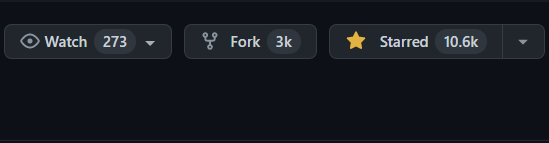

tags: html css js
date: 2021年12月27日
title: 50 天内完成 50 个项目 - HTML&CSS&JavaScript
private: false

# 50 天内完成 50 个项目 - HTML&CSS&JavaScript

逛github摸鱼儿时，发现这个开源的、好玩的、新手练习项目50projects50days。通过html css js实现各种有趣好看的展示效果，3D背景、时钟、拓展卡、模糊加载、拖放、按钮波纹效果等

项目地址：https://github.com/bradtraversy/50projects50days

### piao了两个效果到本博客网站

**1.主题时钟**：[theme-clock](https://github.com/bradtraversy/50projects50days/tree/master/theme-clock)

演示地址：[Live Demo](https://50projects50days.com/projects/theme-clock/)

**2.滚动动画**：[scroll-animation](https://github.com/bradtraversy/50projects50days/tree/master/scroll-animation)

演示地址：[Live Demo](https://50projects50days.com/projects/scroll-animation/)

### 博客主页部分更新

**1.文章列表主题由light转为dark**

**2.新增反爬演示模块**

主要展示后端部分，在反爬中的设计与开，如何与前端交互验证等，包括ip限速、cookie、token、验证码等