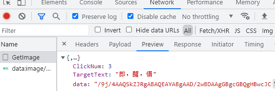
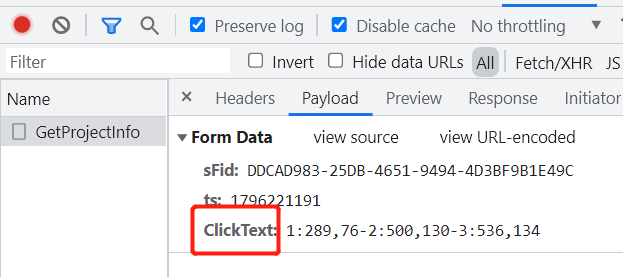

tags: spider
date: 2022年1月10日
title: 零基础体验突破文字点选验证码反爬
private: false

# 零基础体验突破文字点选验证码反爬

不会opencv，不想用pytorch tensorflow，不懂CNN YOLO。它来了，神器推荐：ddddocr，带带弟弟OCR通用验证码识别SDK免费开源版。感谢哲gege开源，项目地址：https://github.com/sml2h3/ddddocr，小星星点起来。

本文通过某简单网站的文字点选验证码来展示ddddocr的友好的用法。目标网站：

> aHR0cDovLzE4My42Ni4xNzEuNzYvU2d4a19RdWVyeQ==

## 1.什么是文字点选验证码

当打开目标网站时，随便点击一条详情，它就来了


抓包看下验证码请求和校验了哪些信息，通过getimage接口请求获取到了targettext：需要点击的文字和data：图片的Base64编码



## 2.目标检测+文字识别

1. 先对各文字进行目标检测，找到位置坐标
2. 对找到的目标区域进行文字识别

以此图片为目标，2.png，需要依次找到“喉”“搓”“绸”


```python
# -*- coding: UTF-8 -*-

import ddddocr
import cv2
import base64

det = ddddocr.DdddOcr(det=True)
ocr = ddddocr.DdddOcr()

with open("2.png", 'rb') as f:
    image = f.read()

# 目标检测
poses = det.detection(image)
print(poses)

im = cv2.imread("2.png")

for box in poses:
    x1, y1, x2, y2 = box
    # 标注画框
    im = cv2.rectangle(im, (x1, y1), (x2, y2), color=(0, 0, 255), thickness=2)
cv2.imwrite("result.png", im)

chars = {}
for box in poses:
    # 对框内文字进行识别
    x1, y1, x2, y2 = box
    corp = im[y1:y2, x1:x2]
    _, tmpimg = cv2.imencode('.png', corp)
    tmp = tmpimg.tobytes()
    result = ocr.classification(tmp)
    print(result)
    chars[result] = [x1, y1, x2, y2]

print('请点击“喉”“搓”“绸”')

for i in ['喉', '搓', '绸']:
    print(i, chars[i])
```

运行程序，生成result.png


同时输出“喉”“搓”“绸”待点击文字的坐标位置

> 喉 [151, 56, 189, 91]  
> 搓 [242, 146, 277, 180]  
> 绸 [515, 148, 545, 176]

## 3.模拟验证码提交请求



ClickText就是点击文字的坐标了，1:x1,y1-2:x2,y2-3:x3,y3，三个目标文字，三个坐标