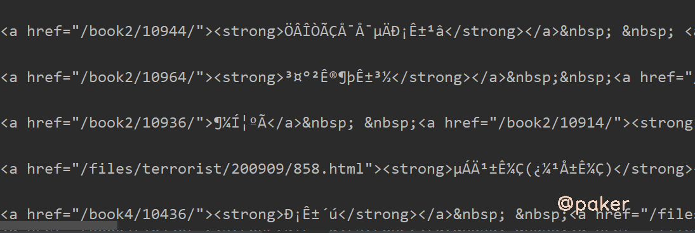
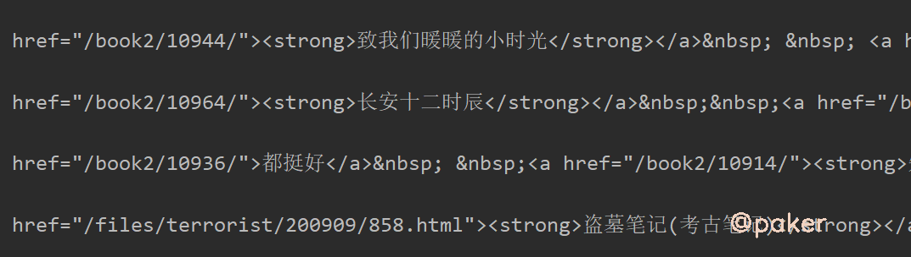
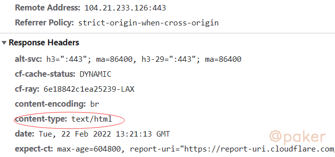
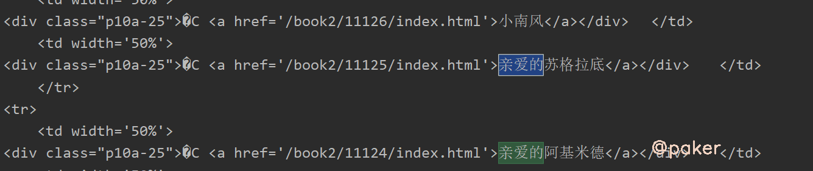
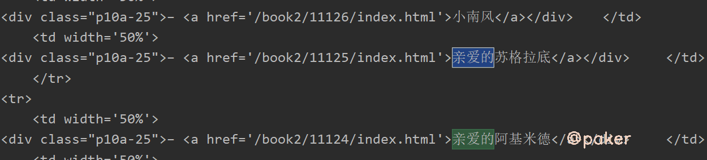
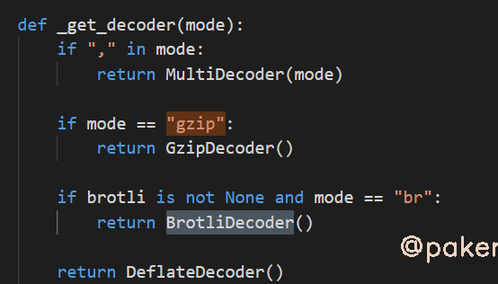
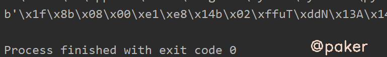
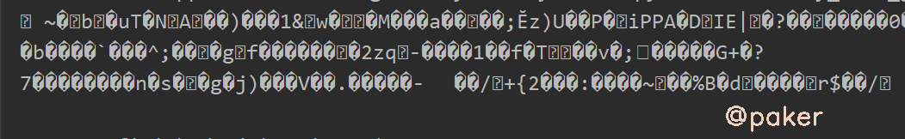
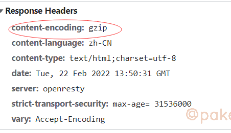

tags: spider
date: 2022年2月22日
title: 可遇不可求的requests乱码问题
private: false

# 可遇不可求的requests乱码问题

偶尔遇到requests请求响应结果是乱码的问题，回头再想找这类网站时却怎么也找不到。本文例举一些常见情况，并通过查看requests源码，乱码问题迎刃而解、豁然开朗。

## 1.encoding&apparent_encoding

别人家的网址：https://www.kanunu8.com/

python请求代码如下

```python
import requests
url = "https://www.kanunu8.com/"
headers = {
    'Accept': 'text/html,application/xhtml+xml,application/xml;q=0.9,image/avif,image/webp,image/apng,*/*;q=0.8,application/signed-exchange;v=b3;q=0.9',
}
res = requests.get(url, headers=headers)
print(res.encoding, res.apparent_encoding)
print(res.text)
```

打印结果，啥呀这是



首先想到encoding设置是否正确，原网页html源码

```html
<meta http-equiv="Content-Type" content="text/html; charset=gb2312">
```

python requests包获取的encoding为

- res.encoding  ISO-8859-1
- res.apparent_encoding  GB2312

encoding是ISO-8859-1

**解决方案**，既然requests默认识别的编码错误，我们手动指定

```python
res.encoding = 'GB2312'
# 或
res.encoding = res.apparent_encoding
```



看看代码为什么默认res.encoding这么重要的设置，还能识别错误

```python
# package requests utils
def get_encoding_from_headers(headers):
    """Returns encodings from given HTTP Header Dict.

    :param headers: dictionary to extract encoding from.
    :rtype: str
    """

    content_type = headers.get('content-type')

    if not content_type:
        return None

    content_type, params = _parse_content_type_header(content_type)

    if 'charset' in params:
        return params['charset'].strip("'\"")

    if 'text' in content_type:
        return 'ISO-8859-1'

    if 'application/json' in content_type:
        # Assume UTF-8 based on RFC 4627: https://www.ietf.org/rfc/rfc4627.txt since the charset was unset
        return 'utf-8'
```

原来是人家网站返回的response headers没有设置charset



**为什么apparent_encoding能正确识别网页编码？**

```python
# package requests models
@property
def apparent_encoding(self):
    """The apparent encoding, provided by the chardet library."""
    return chardet.detect(self.content)['encoding']
```

chardet是python的一个第三方编码检测模块，通过它对网页编码进行检测

## 2.GB2312&GB18030

在（一）中通过设置res.encoding = 'GB2312'已经解决部分问题，实际上还有部分乱码，比如网页中的“ –”显示为乱码了



原因

- GB2312：基本满足了汉字的计算机处理需要，对于人名、古汉语等方面出现的罕用字，GB 2312不能处理。
- GB2312：由中国国家标准总局1980年发布，1981年5月1日开始实施。
- GB2312：基本集共收入汉字6763个和非汉字图形字符682个。

**总之，GB18030更新、更全、更兼容，建议以后代码这样写**

```python
if res.apparent_encoding.lower() == 'gbk' or res.apparent_encoding.lower() == 'gb2312':
	res.encoding = 'GB18030'
```



## 3.gzip, deflate, br压缩

基本遇不到，因为requests使用的urllib3已经处理了服务端返回压缩文本



其他的一些库，如urllib就没有处理

```python
import urllib.request
url = 'https://paker.net.cn/anti/charset'
req = urllib.request.Request(url)
req.add_header('Accept', '*/*')
req.add_header('Accept-Encoding', 'gzip, deflate, br')
req.add_header('Accept-Language', 'zh-CN,zh;q=0.8,en;q=0.6')
req.add_header('Cache-Control', 'max-age=0')
req.add_header('Connection', 'keep-alive')
req.add_header('User-Agent', 'Mozilla/5.0 (Macintosh; Intel Mac OS X 10_10_0) AppleWebKit/537.36 (KHTML, like Gecko) Chrome/49.0.2623.110 Safari/537.36')
f = urllib.request.urlopen(req)
content = f.read()
print(content)
```



**可能会遇到，requests请求不能处自动解压的情况，如**

```python
import requests

url = 'https://paker.net.cn/anti/charset'
headers = {
    'Accept-Encoding': 'gzip, deflate, br',
    # 'User-Agent': 'Mozilla/5.0 (Windows NT 6.3; Win64; x64) AppleWebKit/537.36 (KHTML, like Gecko) Chrome/98.0.4758.82 Safari/537.36',
    'Accept': 'text/html,application/xhtml+xml,application/xml;q=0.9,image/avif,image/webp,image/apng,*/*;q=0.8,application/signed-exchange;v=b3;q=0.9',
    # 'Accept-Language': 'zh-CN,zh;q=0.9',
}
response = requests.get(url, headers=headers)
print(response.text)
```



**解决方案：**

方法一、headers里的Accept-Encoding告诉服务端我支持这几种压缩，把它去掉就好了，浏览器是默认支持的

方法二、通过阅读代码我们知道是根据urllib3是根据response headers里的**content-encoding**来选择对应的解压方法



如果服务端识别出你是一个爬虫请求，比如UA不是正常的浏览器，服务端不设置response headers里的**content-encoding**，

这样requests就没办法自己解压了，可以自己调用gzip解压，或者模拟请求更加真实一点