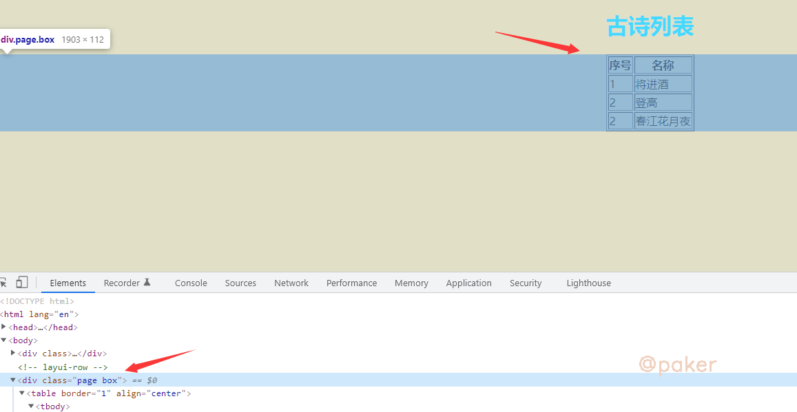
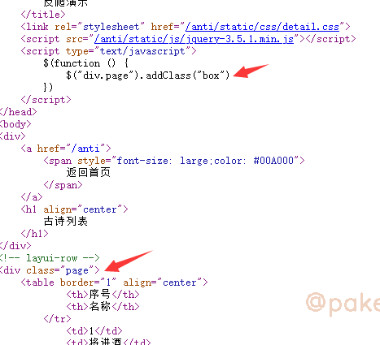
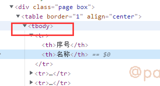
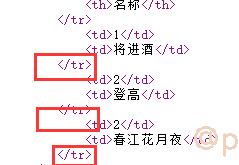

tags: spider
date: 2022年3月2日
title: 别再问xpath定位不到
private: false

# 别再问xpath定位不到

新手可能遇到的问题，在浏览器上使用插件xpath helper能够定位提取数据，为什么使用python中的xpath方法怎么也定位不到？本文列举一下可能的几种情况，怎么说呢，这种问题自己随便百度一下就能找到答案。em，有些同学以后就不用再问了。。。

## 1.js惹的祸

示例网址：https://paker.net.cn/anti/xpath



在 div class="page box"里，使用xpath helper插件看一下，//div[@class='page box']正确定位高亮了


用python请求并解析看看，结果是输出为空，没有提取到序号和古诗名称

```python
import requests
from lxml import etree

response = requests.get('https://paker.net.cn/anti/xpath')
print(response.text)
html = etree.HTML(response.text)
print(html.xpath("//div[@class='page box']//text()"))
```

此时，我们右键-查看网页源代码



好家伙，人家原来class=“page”，在script里经过addClass操作，展示出来时才变为class="page box"

因为python requests包请求后响应response.text是不能渲染和执行js的等同于查看网页源代码看到的html内容，所以呢通过查看网页源代码找到正确的标签样式就搞定了

## 2.浏览器补全规范化

一样的示例网址：https://paker.net.cn/anti/xpath

**一、 tbody标签**



解决了js惹的祸问题后，xpath这样写了//div[@class='page']/table/tbody/tr/td[2]，纳尼？还拿不到数据。

还是看看那网页源代码，没有tbody标签的，这个是浏览器自己加上的


ok，tbody不存在，xpath这样写了//div[@class='page']/table/tr/td[2]

**二、标签不闭合**

报告，还是拿不到数据，再探网页源代码！



只有《/tr》，《tr》哪去了，被哪个小可爱吃掉了。想想办法，python如何把不闭合的标签补全？用它html5lib

```python
import requests
from lxml import etree
from lxml.html import tostring, html5parser
# html5parser底层就是调用了html5lib
response = requests.get('https://paker.net.cn/anti/xpath')
shtml = etree.HTML(tostring(html5parser.fromstring(response.text)))
print(shtml.xpath("//div[@class='page']/table//tr/td[2]/text()"))
```

最后输出 ['将进酒', '登高', '春江花月夜']，到此就是成功了

## 3.iframe

示例网址：https://xxgk.mot.gov.cn/2020/jigou/?gk=5


浏览器上的xpath helper都无法定位了，怎么办？

不慌，一不小心就翻到了，**iframe**提供了一个简单的方式把一个网站的内容嵌入到另一个网站中


所以我们真实该访问的链接是：https://xxgk.mot.gov.cn/2020/jigou/list.html，此时就可以正常定位了

