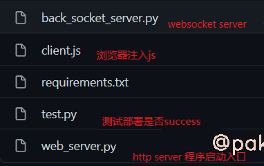
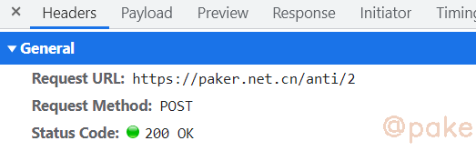
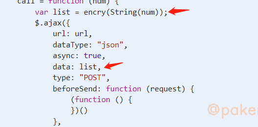
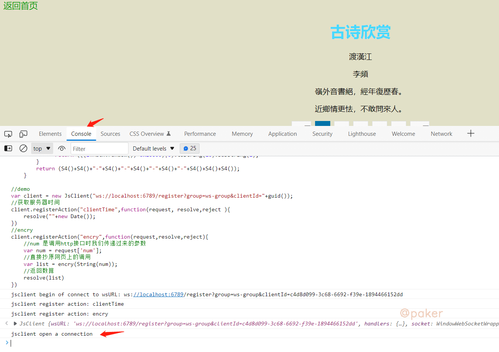
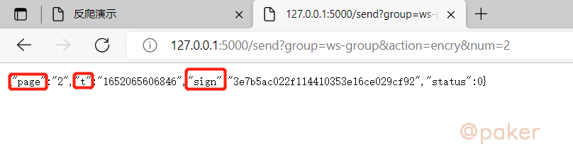

tags: python
date: 2022年5月9日
title: python开发jsrpc服务与演示
private: false

# 实战：python开发jsrpc服务与演示

项目地址：https://github.com/sixgad/py-jsrpc

***py-jsrpc***

python实现一套轻量、协程异步、websocket远程调用服务，js逆向、混淆加密一把梭，再也不用扣js了。

## 1.食用方法

> git clone git@github.com:sixgad/py-jsrpc.git
>

> pip install -r requirements.txt

## 2.模块说明



因为是协程，选择了支持asyncio的sanic这个web开发框架，websockets这个websocket包

## 3.实战

以反爬演示平台下的示例2为例，地址：https://paker.net.cn/anti/2

数据是从这个接口返回，post请求



请求数据如下，page为页码，t为时间戳，sign为加密数据


js请求是从这里发出的



其中encry(String(num))返回了post请求需要的参数

按照以前的方法，追进encry方法里还原加密逻辑算法，或者把encry方法js全部扣下来，用node环境执行。

使用rpc调用+[py-jsrpc](https://github.com/sixgad/py-jsrpc)，只能说不要太简单，具体操作如下：

**1.修改client.js**

直接拉倒底部，注册action “encry”

```javascript
//demo
//group很重要，每个项目应该有一个独立的group，比如爬百度时group=baidu-group，爬抖音时group=dy-group,
//可以同时存在多个group，互不影响
var client = new JsClient("ws://localhost:6789/register?group=ws-group&clientId="+guid());
//获取服务器时间
client.registerAction("clientTime",function(request, resolve,reject ){
    resolve(""+new Date());
})
//encry
client.registerAction("encry",function(request,resolve,reject){
    //num 是调用http接口时我们传递过来的参数
    var num = request['num'];
    //直接抄原网页上的调用
    var list = encry(String(num));
    //返回数据
    resolve(list)
})
```

**2.启动web_server.py & 浏览器注入js**

启动 http server

> python python web_server.py

浏览器注入js，在目标网站https://paker.net.cn/anti/2，打开控制台(F12), Console下注入client.js



jsclient open a connection, 说明已经连接成功，可以调用请求http接口获取在浏览器内js执行返回的结果

**3.调用接口，获取js执行结果**

http接口：http://127.0.0.1:5000/send?group=ws-group&action=encry&num=2

接口里的action，num对应第一步 client.js。



本文只是提供了最简单的demo，jsrpc可以使用的场景很多，比如某数的cookie，某音，98k等等