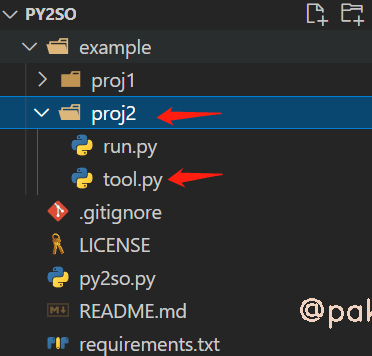
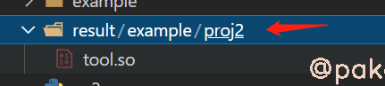

tags: python
date: 2022年5月18日
title: python如何保护源代码？拒绝bp
private: false

# python如何保护源代码？拒绝bp

本文通过使用py2so，在linux下将python代码编译为so文件，实现了“加密”保护源代码的需求，同时带来了性能提升。

项目地址：https://github.com/sixgad/py2so

## 1.常用加密方法

|    加密手段    |                            优缺点                            |
| :------------: | :----------------------------------------------------------: |
| 发行 .pyc 文件 | 简单方便，.py 能在哪里运行，.pyc 就能在哪里运行。有现成的反编译工具，破解成本低。 |
|    代码混淆    | 兼容性好，只要源码逻辑能做到兼容，混淆代码亦能。代码结构未发生变化，也能获取字节码，难度有限。 |
|  pyinstaller   |       Windows 系统上，直接打包成 exe，方便分发和执行。       |
|    Cpython     | 生成的二进制 .so 或 .pyd 文件难以破解。兼容性稍差，对于不同版本的操作系统，可能需要重新编译。 |

## 2.使用教程

**项目结构**


**安装**

> git clone [git@github.com](mailto:git@github.com):sixgad/py2so.git
>
> pip install -r requirements.txt

**查看帮助**

> python py2so.py -h

```shell
py2so use help

optional arguments:
  -h, --help            show this help message and exit
  -f FILE, --file FILE  Python文件 (如果使用-f, 将编译单个Python文件)
  -d DIRECTORY, --directory DIRECTORY  Python项目路径 (如果使用-d参数, 将编译整个Python项目)
  -i IGNORE, --ignore IGNORE  标记你不想编译的文件或文件夹路径 注意: 文件夹需要以路径分隔符号（\`/\`或\`\\\`，依据系统而定）结尾，并且需要和-d参数一起使用 例: -i main.py,mod/__init__.py,exclude_dir/
  -r, --remove          清除所有中间文件，只保留加密结果文件，默认False
```

## 3.具体示例

1. **编译单个文件，结果默认生成在result文件夹**



> python py2so.py -f example/proj2/tool.py -r



此时的tool.so可以被正常引用，我们把example》proj2下的run.py复制过来，运行run.py


2.**编译整个python项目，忽略主文件run.py**


> python py2so.py -d example/proj1/ -i run.py -r


直接在result下得到完整的项目，tool.py已经被编译为tool.so，我们直接运行主文件run.py

