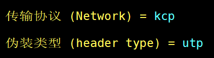

tags: v2ray
date: 2022年11月9日
title: 真香！一键安装配置V2ray脚本
private: false

# 真香！一键安装配置V2ray脚本

干啥用的？懂的都懂

社区地址：https://github.com/v2fly/v2ray-core

最好用的 V2Ray服务端 一键安装脚本 & 管理脚本：https://github.com/233boy/v2ray/tree/master

Android代理客户端：https://github.com/2dust/v2rayNG

Windows代理客户端：https://github.com/2dust/v2rayN

**服务端一键安装脚本使用：**

**安装**

> ```
> bash <(curl -s -L https://git.io/v2ray.sh)
> ```

安装完成后，输入 `v2ray` 即可管理 V2Ray

v2ray url  可生成 vmess URL 链接，客户端可一键导入配置（真心方便）

**多种协议可选，eg：**



**常见问题（墙）：**

更换端口、协议

通过https://www.itdog.cn/ping/检查海外vps IP是否被黑