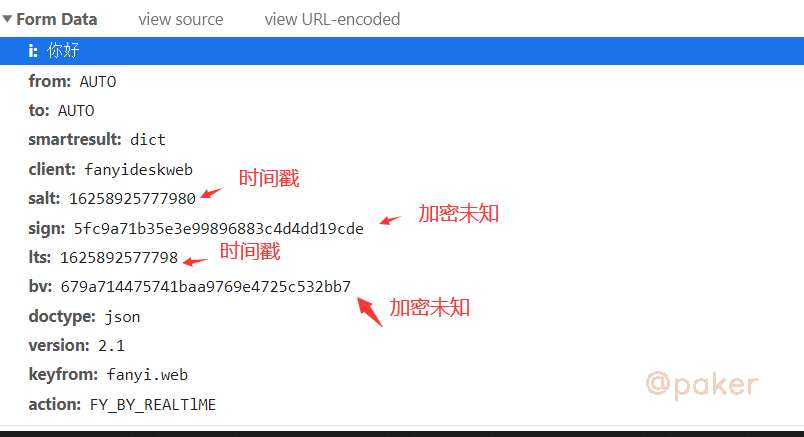
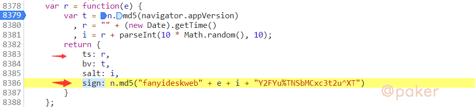

tags: spider js逆向
date: 2021年7月30日
title: 入门-python实现某道翻译sign和bv
private: false

# 入门-python实现某道翻译sign和bv

本文介绍如何通过python实现某道翻译的js生成的sign和bv，某道翻译地址(base64)：aHR0cHM6Ly9mYW55aS55b3VkYW8uY29tLw==

## 1.chrome抓包分析

获取数据的接口https://\*.\*dao.com/translate_o?smartresult=dict&smartresult=rule

请求方式POST

请求参数：其中sign bv这俩个参数一坨，应该是加密过后生成



## 2.定位加密参数位置

在chrome控制台设置XHR断点或者全局搜索sign,最终定位到参数加密生成位置，这段js代码未混淆，逻辑非常清晰



## 3.python实现

```python
# -*- coding: utf-8 -*-
# @Time   : 2021/7/10 13:16
# @Author : zp
# @Python3.7

import hashlib
import time
import random

kwd = '你好'
appversion = '5.0 (Windows NT 10.0; Win64; x64) AppleWebKit/537.36 (KHTML, like Gecko) Chrome/91.0.4472.106 Safari/537.36'
m = hashlib.md5()
m.update(appversion.encode())
bv = m.hexdigest()
r = time.time()
lts = int(r * 1000)
salt = lts*10+random.randint(1,10)
sign = "fanyideskweb" + kwd + str(salt) + "Y2FYu%TNSbMCxc3t2u^XT"
m = hashlib.md5()
m.update(sign.encode())
sign = m.hexdigest()
data = {
  'i': kwd,
  'from': 'AUTO',
  'to': 'AUTO',
  'smartresult': 'dict',
  'client': 'fanyideskweb',
  'salt': str(salt),
  'sign': sign,
  'lts': str(lts),
  'bv': bv,
  'doctype': 'json',
  'version': '2.1',
  'keyfrom': 'fanyi.web',
  'action': 'FY_BY_REALTlME'
}
```

最后使用requests发送请求返回结果{"translateResult":[[{"tgt":"hello","src":"你好"}]],"errorCode":0,"type":"zh-CHS2en"}
