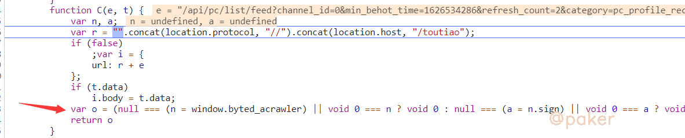
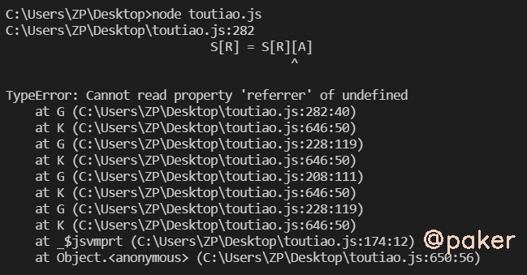
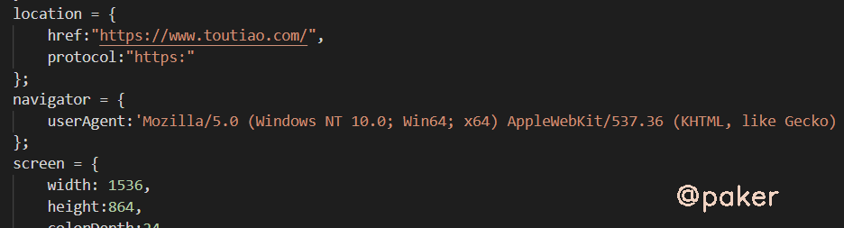
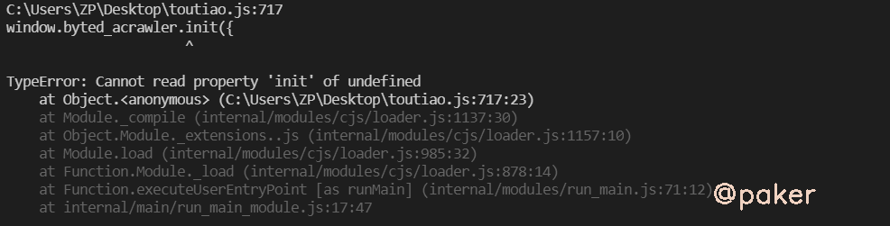
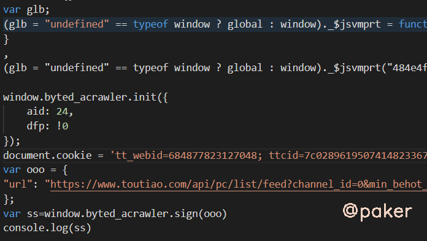

tags: spider js逆向
date: 2021年9月28日
title: 2021某某头条推荐页_signature
private: false

# 2021某某头条推荐页_signature

2021某某头条web新版_signature生成方法。大概在2021年5月，某某头条稍微更新了数据接口和生成_signature的js方法，但是没有校验，带不带signature都能获取数据。本着学习的态度我们来看下_signature在哪里生成。

网站地址(base64)：aHR0cHM6Ly93d3cudG91dGlhby5jb20v

> 截至到发文日期2021年7月，某某头条对_signature仍然没有校验

## 1.chrome抓包分析

推荐页获取数据接口：https://\*\*.toutiao.com/api/pc/list/feed

请求方式：GET

请求参数：其中_signature是密文

## 2.定位加密参数位置

全局搜索_signature，在indexjs里发现 _signature：a,而a=C(n,e)，很明显我们要追进C函数看看

C函数长这个样子箭头那行是JS条件运算符（?:）

等价于window.byted_acrawler.sign({"url":"https://\*\*.toutiao.com/toutiao/api/pc/\*\*"})，返回的结果o就是我们想要的_signature

继续追进去就会跳到acrawler.js了，各种运算就在这里了。对于window.byted_acrawler存在疑问，这不是window对象自有的属性，肯定是头条的js在某处对其进行赋值，在html里我们发现这样一段代码window.byted_acrawler.init({aid:24,dfp:!0})，记录下来会有用

## 3.补环境，扣代码

将acrawler.js全部拷贝到本地，nodejs直接运行会报错，需要补环境

补环境，能想到的就是window,document,location,navigator,screen,history,chrome，这些都很通用(估计每个人都有自己的代码小仓库，这种通用的直接拷过来用就好)，或者可以在chrome控制台打印，比如screen

本地nodejs补全的环境**部分**示例如下

再次运行还是报错

我们排查下原因，发现在这行有很多条件运算，(glb = "undefined" == typeof window ? global : window)._$jsvmprt(\*\*\*"undefined" != typeof exports ? exports : void 0, "undefined" != typeof module，这里其实是对是不是处于浏览器环境的检测，exports  module是在node环境下特有的与真实的浏览器环境不同，后边还有很多但是好像没有检测(那就不管,能跑就行)，应对方法很简单

> exports = undefined;
>
> module = undefined;

最后运行以下代码就能输出_signature了：_02B4Z6wo00f01-.UTGQAAIDAECuzmEPSkzvv9kjAAJsRO\*\*\*

