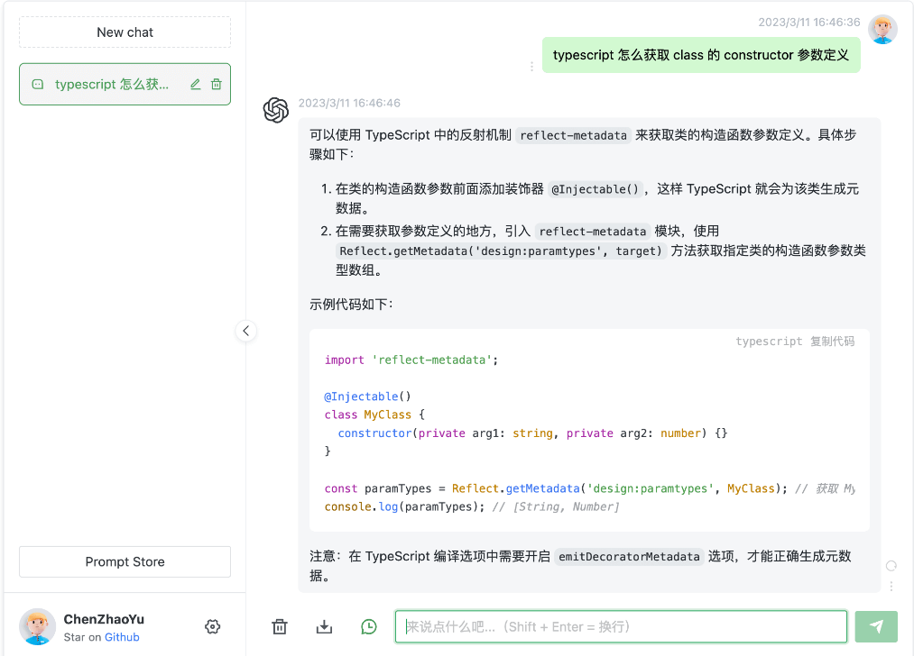

tags: nodejs
date: 2023年5月11日
title: 基于chatgpt-web+mongodb构建社区问答收集系统
private: False

# 基于chatgpt-web+mongodb构建社区问答收集系统

问：如何收集不同领域、不同专业人员的高质量问答对呢？

答：调用chatgpt4啊！

问：谁去调用？谁去想问题？怎么把用户的问题收集入库，供自己的模型进行训练呢？

答：开放一个免费的问答系统，后端调用openai，将社区千奇百怪的问题收集过来，喂给自己的模型。

chatgpt交互界面令人眼前一亮，自己如何搭建这样一套界面呢？

推荐项目：

> https://github.com/Chanzhaoyu/chatgpt-web
>
> 界面看起来很清爽，使用Docker compose部署so easy



## 魔改，加入mongodb收集问答对

通过对开源项目源码阅读，原项目只是封装了一层对openai api的请求，响应内容会直接展示在web界面上。

寻找切入点：

> service/src/index.ts中有如下方法
>
> router.post('/chat-process', [auth, limiter], async (req, res) => {
>
> 此处就是向openai发起请求的位置

由于是stream的方式，实现界面上一字一字展示的效果，所以要在最后一个字结束时，将完整的消息插入数据库。

加入insermongo方法后，此段代码为

```js
router.post('/chat-process', [auth, limiter], async (req, res) => {
  res.setHeader('Content-type', 'application/octet-stream')

  try {
    const { prompt, options = {}, systemMessage, temperature, top_p } = req.body as RequestProps
    let firstChunk = true
    await chatReplyProcess({
      message: prompt,
      lastContext: options,
      process: async (chat: ChatMessage) => {
		//判断是否打印完成最后一个字
        if(isLastMmessage(chat)) {
          await insertDB(req.body, chat)
        }
		//以上，调用封装了mongodb insertDB方法插入数据库
        res.write(firstChunk ? JSON.stringify(chat) : `\n${JSON.stringify(chat)}`)
        firstChunk = false
      },
      systemMessage,
      temperature,
      top_p,
    })
  }
  catch (error) {
    res.write(JSON.stringify(error))
  }
  finally {
    res.end()
  }
})
```

封装mongodb部分代码如下

```js
const { MongoClient } = require('mongodb');
import type { ChatMessage } from '../chatgpt'
import type { RequestProps } from '../types'


const user = '';
const password = '';
const dbName = '';
const dbHost = '';
const dbPort = 27017;

const uri = `mongodb://${user}:${password}@${dbHost}:${dbPort}/${dbName}?authSource=admin`;

// Connection URL
const url = uri;
const client = new MongoClient(url);
let collection;

async function main() {
  // Use connect method to connect to the server
  await client.connect();
  console.log('Connected successfully to server');
  const db = client.db(dbName);
  collection = db.collection('message');

  // the following code examples can be pasted here...
  return 'done.';
}

async function insertDB(req: RequestProps, chat: ChatMessage) {
    const question = {
        prompt: req?.prompt,
        parentMessageId: req?.options?.parentMessageId || '',
        answerId: chat?.id,
        answerText: chat?.text,
        answerCreated: chat?.detail?.created,
        answerModel: chat?.detail?.model,
      }
      await collection.insertOne(question);
}

main()
  .then(console.log)
  .catch(console.error)

export { insertDB }
```

insertDB方法里的question结构化了要入库的字段信息，样例数据如下

```json
{
    "_id" : ObjectId("a9f9f76fb"),
    "prompt" : "这个分布似乎介于指数分布和帕累托分布之间",#当前问题
    "parentMessageId" : "chatcmpl-MvYoOcZyxxhiCe",#上一个回答ip
    "answerId" : "chatcmpl-75o5WFqZL6VT6o",#当前回答id
    "answerText" : "根据您的描述，这个分布似乎介于指数分布和帕累托分布之间。为了详细阐述这两种概率分布，请允许我对它们进行简要介绍。",#当前回答
    "answerCreated" : 1681458373,
    "answerModel" : "gpt-4-0314"
}
```
