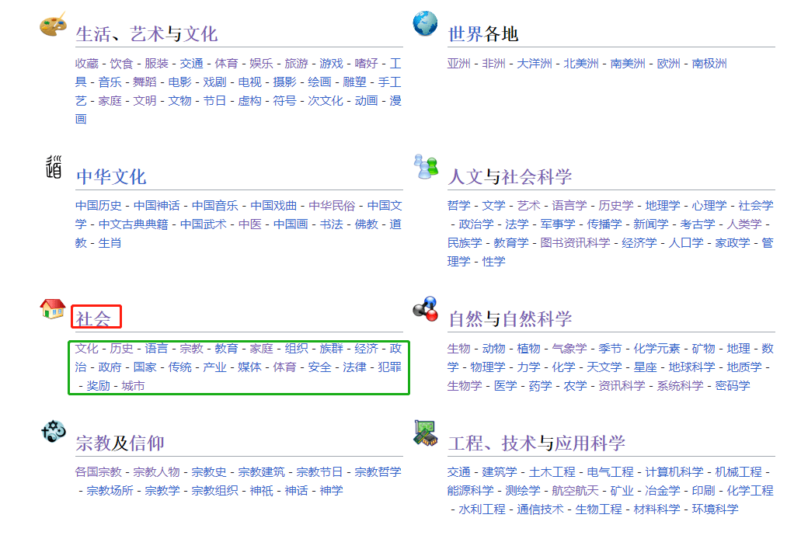
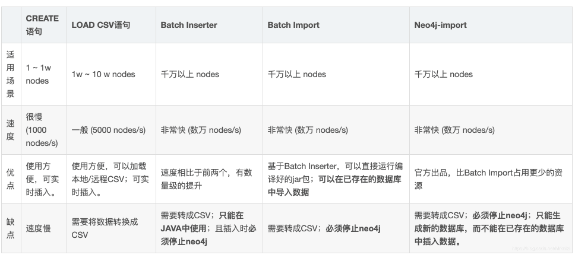
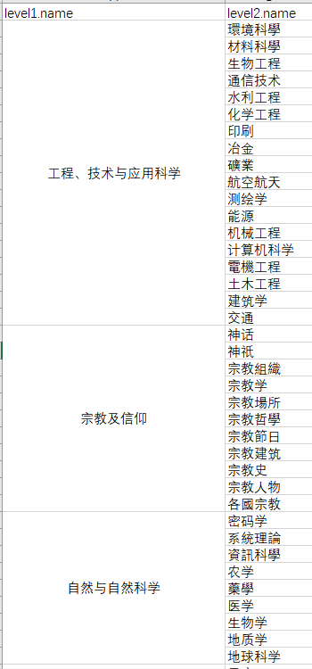

tags: neo4j,分类树,wiki
date: 2023年9月16日
title: 基于neo4j的wiki分类树构建
private: False

# 基于neo4j的wiki分类树构建

**目的：**

1. 构建世界知识分类树
2. 便于模型训练时对某一不均衡类别数据的抽取

**采集wiki分类信息：**

中文分类首页：https://zh.wikipedia.org/wiki/Wikipedia:%E5%88%86%E9%A1%9E%E7%B4%A2%E5%BC%95

首页展示了一级和二级分类，内部更深层次分类采用爬虫收集



**数据存储：**

在数据收集时，爬虫只需保留以下关系

```json
{
    "child" : "电影",
    "parent" : "生活、艺术与文化"
}
```

为了便于后期分类树的生成和分析，引入neo4j这个图数据库。

*遇到的挑战，当节点和关系较多时，如何快速导入neo4j？*



> 采用neo4j-admin import，命令如下，“啪就站起来了，很快啊!”
>
> ./neo4j-admin import --database=wikicnen --nodes=../import/cnwk_nodes.csv --nodes=../import/enwk_nodes.csv --relationships=../import/cnwk_rels.csv --relationships=../import/enwk_rels.csv 

**实体分类树构建：**

小试牛刀，查找前两层节点，可以看到，分类最后应该是一个关系网。

> MATCH (root:cnwk {name: 'cnwkdataset'})-[:HAS_CHILD]->(level1)-[:HAS_CHILD]->(level2) RETURN root, level1, level2

导出excel，通过kutools插件，合并



最后通过子节点向上查找，构建完成百万级实体分类树。

> ```
> MATCH path = (child:cnwk {name:"篮球"})-[:HAS_PARENT*..25]->(parent:cnwk {name:"cnwkdataset"}) with path limit 100
> ```

当遇见一个实体归属于多个类别时，通过到二级分类的最短路径来过滤，保留路径最短的链路。
