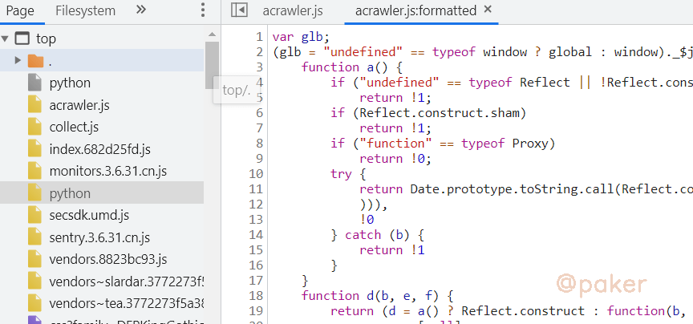
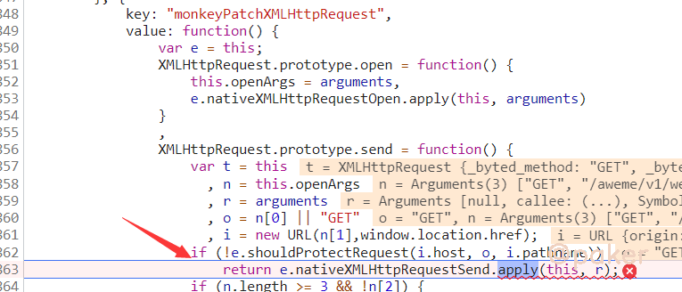
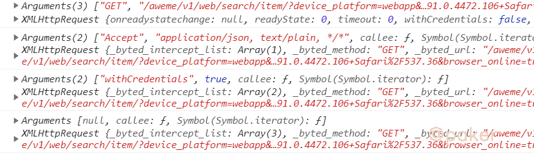
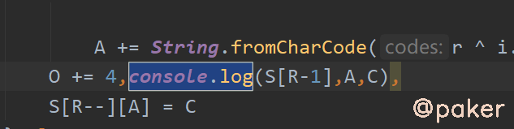
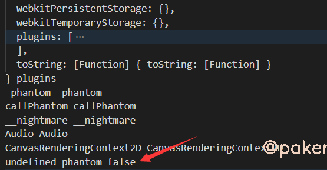
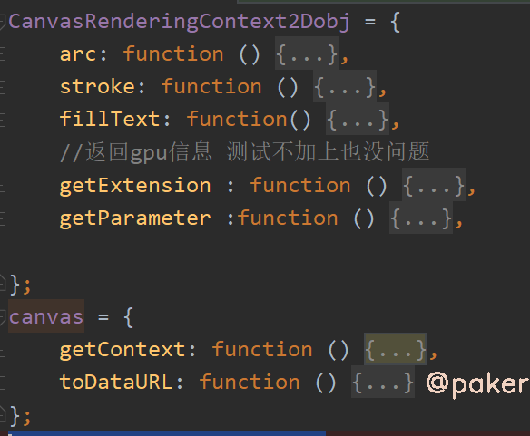
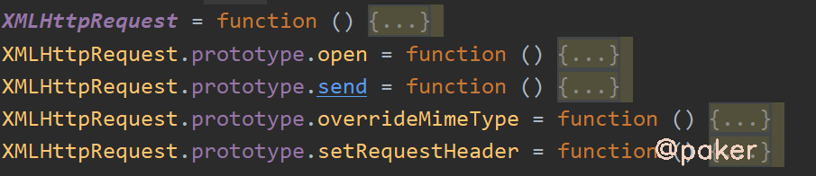
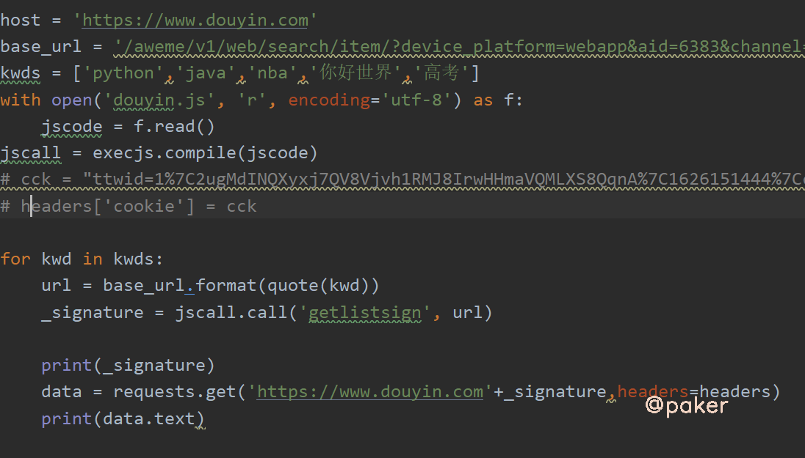
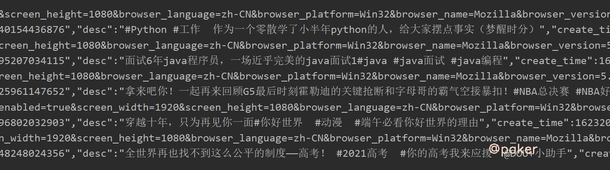

tags: spider js逆向
date: 2021年9月28日
title: 2021某音_signature Need Verifying
private: False

# 2021某音_signature Need Verifying

2021年6月某音上线了web版，上班摸鱼更加方便了。本着学习的态度，各个板块数据接口只有_signature一个加密参数，因为都属于字节系，搞过头条的话上手更加容易些。

> 推荐首页，个人主页对于_signature校验不严格，搜索接口对signature校验很严格，加密参数稍有不对就会返回Need Verifying，本文就讨论某音搜索接口

## 1.跳过抓包分析，不会的可以看上一篇某日头条，基本差不多

很熟悉的acrawler.js



搞过头条的都知道，要找到 window.byted_acrawler.init，全局搜索在indexjs中找到，其中变量可以打断点调试

```javascript
window.byted_acrawler.init({
    aid: U,
    dfp: !1,
    boe: !1,
    intercept: !0,
    enablePathList: ["/aweme/v1/*", "/aweme/v2/*"].concat(L(e || []))
})
```

按照套路，全局搜索_signature ，结果是**找不到！！！**，设置个XHR断点看看



重写了XMLHttpRequest的一些方法，此时t=this里面的_url已经有了signature参数了，顺着Call Stack往回找找看看,在acrawler.js中调用了e()函数

```javascript
(U = function e() {
    var f = arguments;
    //此处可本地替换js代码 或者使用chrome的logpoint打印
    //console.log(argumentsthis)
    return e.y > 0 ? K(b, e.c, e.l, f, e.z, this, null, 0) : (e.y++,
    K(b, e.c, e.l, f, e.z, this, null, 0))
})
```

在控制台上会看到如下输出



熟悉的朋友应该知道，这不就是构造XMLHttpRequest请求的过程吗,在arguments为null的时候，XMLHttpRequest里已经有_signature参数了。把头条的那套环境拿过来用一下代码如下：


结果：Need Verifying，虽然程序不报错，但是没通过人家的后端校验啊，就是说我们模拟的环境被检测或者不够全，与真实浏览器相差很多。由于字节系列使用了jsvm技术，硬刚跟代码不太可能。应对方法就是插桩：代码里的这个String.fromCharCode字符串生成的地方 都插个桩，eg.



## 2.补环境，更深，更隐蔽

当插完桩后，node douyin.js > a.txt，在这个文件中我们会看到，类似箭头所指的这行都是环境检测，如webdriver，phantom，hook等等，也会发现很多我们之前没补过的环境PluginArray，toString等等。这里我就是从头对比本地执行和浏览器执行输出的日志差异一点一点补全的。




## 3.需要注意的检测点(部分)
canvas



浏览器插件


XMLHttpRequest



toString


## 4.看下效果



