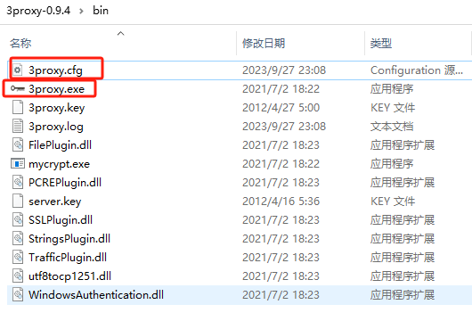

tags: proxy
date: 2023年10月7日
title: 隧道代理
private: False

# 隧道代理

可以参考下青南大佬的这篇文章，使用redis存储代理ip+openresty转发

> https://juejin.cn/post/6988289418637344782

**下面分享下我是如何实现的**，手中有一批静态长效socks代理，Windows下通过3proxy搭建一个转发隧道。

> https://github.com/3proxy/3proxy/releases

**编辑配置文件3proxy.cfg**

```
# daemon
# nserver 8.8.8.8
# nserver 8.8.4.4
# nscache 65536


# timeouts 1 5 30 60 180 1800 15 60
log 3proxy.log
# users username:CL:password
# auth none
allow *


# 权重和为1000
parent 500 socks5 134.*.*.3 9999 name pwd
parent 500 socks5 23.*.*.131 9999 name pwd


proxy -p9999
```

**3proxy目录结构**



**启动**

> 3proxy.exe 3proxy.cfg

**检验**

使用浏览器代理插件，设置隧道ip和端口（此处为127.0.0.1和9999）


访问 http://ip111.cn/ ip检测网站，每次请求的ip都会变换，实现了隧道代理。


