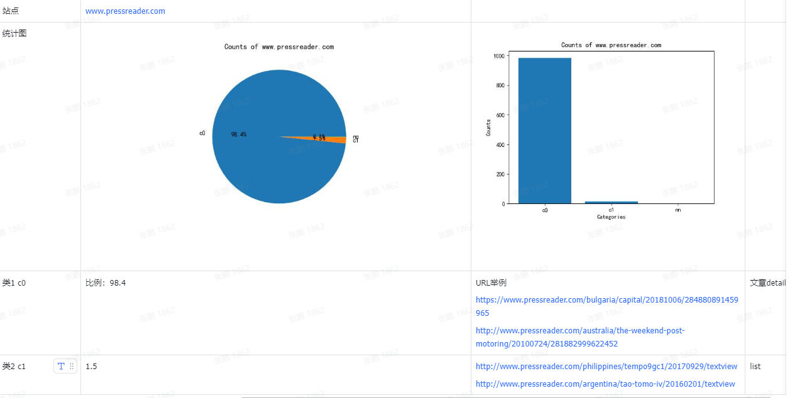
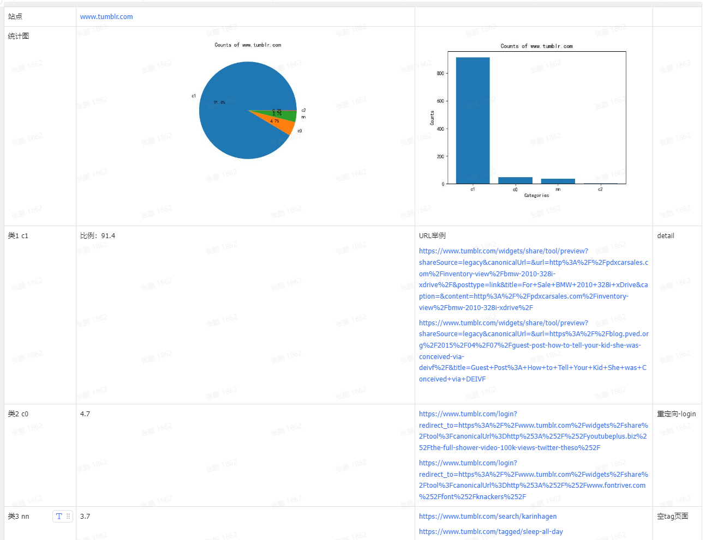

tags: similarity
date: 2023年10月7日
title: 基于结构和样式相似度的html聚类研究
private: False

# 基于结构和样式相似度的html聚类研究

> 参考论文：https://sci-hub.se/10.1109/IRI.2016.30

论文中提到的几点，*网页结构相似度，样式相似度，聚类*。本文依据论文思路和相关算法，用代码大致复现。

**结构相似度**

文中提到了APTED全路径树编辑距离算法。

```python
from lxml import html
from apted import APTED, helpers


def lxml_to_tree_structure(html_content):
    tree = html.fromstring(html_content)

    def parse_node(node):
        if isinstance(node, html.HtmlElement):
            tag = node.tag
            children = [parse_node(child) for child in node.iterchildren()]
            return '{%s%s}' % (tag, ''.join(children))
        elif isinstance(node, html.HtmlComment):
            return ""
        else:
            return ""

    return parse_node(tree)


def structural_similarity(html_1, html_2):
    # 转换为APTED的树表示
    tree1 = helpers.Tree.from_text(lxml_to_tree_structure(html_1))
    tree2 = helpers.Tree.from_text(lxml_to_tree_structure(html_2))

    apted_class = APTED(tree1, tree2)

    # 计算编辑距离
    distance = apted_class.compute_edit_distance()
    # print(distance)

    # 计算相似度
    return 1 - distance / (apted_class.it1.tree_size + apted_class.it2.tree_size)
```

但当我们实际使用时，发现算法复杂度极高，尤其对于当前时代的网页结构，dom节点更为丰富的情况下，可尝试优化为使用 html 标签的序列比较来计算相似度。

**样式相似度**

```python
from lxml import etree

def get_classes(html):
    doc = etree.HTML(html)
    classes = set(doc.xpath('//*[@class]/@class'))
    result = set()
    for cls in classes:
        for _cls in cls.split():
            result.add(_cls)
    return result


def jaccard_similarity(set1, set2):
    set1 = set(set1)
    set2 = set(set2)
    if len(set1) == 0 and len(set2) == 0:
        return 1
    intersection = set1.intersection(set2)
    union = set1.union(set2)

    return len(intersection) / len(union)


def style_similarity(page1, page2):
    """
    Computes CSS style Similarity between two DOM trees

    A = classes(Document_1)
    B = classes(Document_2)

    style_similarity = |A & B| / (|A| + |B| - |A & B|)

    :param page1: html of the page1
    :param page2: html of the page2
    :return: Number between 0 and 1. If the number is next to 1 the page are really similar.
    """
    classes_page1 = get_classes(page1)
    classes_page2 = get_classes(page2)
    return jaccard_similarity(classes_page1, classes_page2)
```

**聚类**

文中使用的是共享最近邻算法，复现时使用**DBSCAN**，一种基于密度的聚类方法。

```python
import numpy as np
from sklearn.cluster import DBSCAN
htmls = ["<html></html>",]
threshold = 0.9
similarity_matrix = np.zeros((len(htmls), len(htmls)))

# 需要计算相似度矩阵, similarity_matrix由结构相似度和样式相似度计算得到
"""
code...
"""


# 假设你有一个距离矩阵
# 注意，DBSCAN需要一个距离矩阵，而不是相似度矩阵
# 你可能需要将你的相似度矩阵转换为距离矩阵，例如，通过 d = 1 - s
distance_matrix = 1 - similarity_matrix

# 使用DBSCAN进行聚类
# eps是邻域的大小，min_samples是形成核心对象所需要的最小邻居数目
# 你可能需要调整这些参数来得到好的聚类结果
clustering = DBSCAN(eps=1 - threshold, min_samples=2, metric='precomputed')
labels = clustering.fit_predict(distance_matrix)
```

**结果**

从cc数据中抽取了部分域名的网站，聚类结果大致如下：




