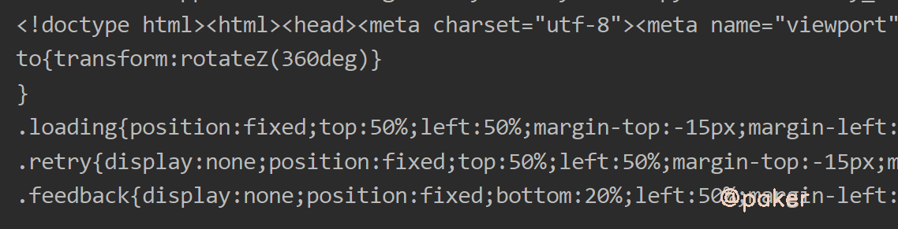
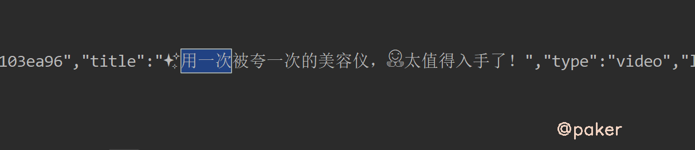
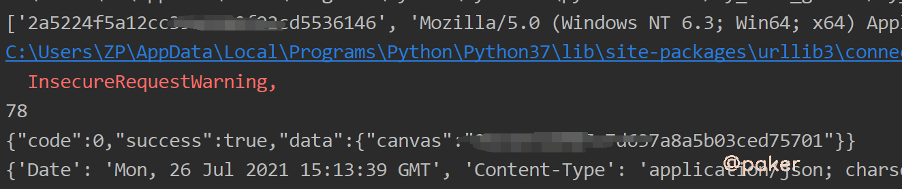

tags: spider js逆向
date: 2021年7月30日
title: 某红书web个人主页cookie：timestamp2生成
private: false

# 某红书web个人主页cookie：timestamp2生成

某红书web版上面的数据比较少，本着学习的态度，我们来看下web版访问页面必带的cookie：timestamp2的生成算法。网站地址(base64):aHR0cHM6Ly93d3cueGlhb2hvbmdzaHUuY29tL3VzZXIvcHJvZmlsZS81YzZjMzA5OTAwMDAwMDAwMTAwMWQ3MGQ=

## 1.确认必传的cookie值

个人主页的视频列表是静态数据，当我们不带cookie直接访问时会返回这样的一坨东西，没有我们想要的数据

当我们带着cookie访问时，能正常返回数据（经过测试cookie里的timestamp2，为必传的值）

## 2.定位cookie生成位置

我们全局搜索timestamp2的值(eg.20210726f5tr7588haec2ffad1601610)时会在https://\*\*.xiaohongshu.com/fe_api/burdock/v2/shield/registerCanvas?p=cc这个接口发现response headers里有set-cookie: timestamp2=20210726f\*\*\*,只要我们能访问这个接口就能获得cookie timestamp2的值。

此接口有两个请求参数，id和sign

​	

设置一个xhr断点，就能找到生成请求参数的那段js了

这已经很明显了,我们继续根据堆栈调用找i,a。这个地方i.data为浏览器的一些属性(指纹)，直接拷贝下来copy(i.data)，参数有了，我们再将e方法扣下来

## 3.扣代码(不用补环境,已经将浏览浏览器属性收集完了i.data)

e方法长这样，直接拷贝下来，node运行哪里报错点哪里

e方法结尾处u,c就是我们需要的id和sign，所以这个l方法直接注释掉，在这里直接return [u,c]

当时迷惑的地方T()(o = ["webgl"]).call(o, i.key) && M()(i.value)),一个方法()(参数)，可以理解为

方法里好多用到了检查参数类型的地方比如，基本都是return true的

最终来看一下我们能不能通过js生成的id和sign去请求registerCanvas?p=cc接口获得timestamp2 cookie

带着这个cookie去访问个人主页，就能获取博主的视频列表啦