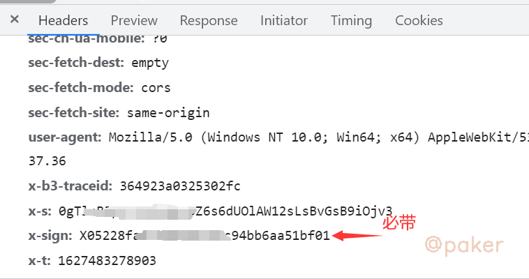
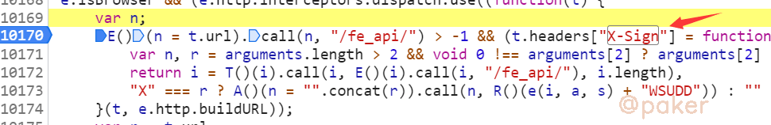
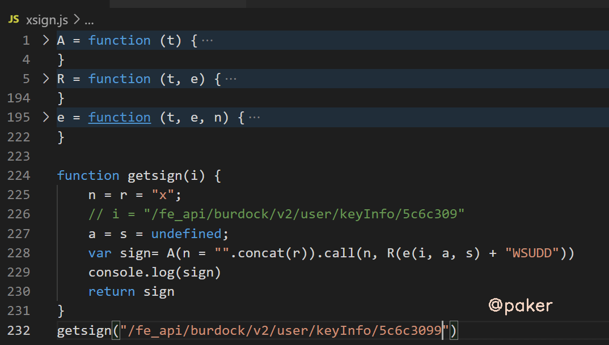

tags: spider js逆向
date: 2021年8月19日
title: 某红书web个人主页x-sign
private: true

# 某红书web个人主页x-sign

上一篇我们学习了关键cookie生成的加密算法，本文学习一下粉丝数、关注数接口的header参数x-sign，网址：

aHR0cHM6Ly93d3cueGlhb2hvbmdzaHUuY29tL3VzZXIvcHJvZmlsZS81YzZjMzA5OTAwMDAwMDAwMTAwMWQ3MGQ=

## 1.抓包分析

粉丝数接口：https://\*\*\*.某红书.com/fe_api/burdock/v2/user/keyInfo/5c6c3099000000001001d70d

请求方式：GET



直接给出结论：header里的x-sign必带，x-t x-s可以忽略(我猜的)

不带x-sign时会返回

> {"code":-1,"errCode":-1,"success":false,"msg":"Not Acceptable"}

x-sign正确时(返回数据静态字体加密，后边会有单独的文章记录，此篇只负责获取数据)

> {"code":0,"success":true,"data":{"fans":"&#xefab;&#xe1f2;&#xeffa;&#xecfa;"。。。

## 2.x-sign定位

全局搜索x-sign，在launcher.js里找到，反手就是一个断点



注意"X" === r这行的问号表达式，i = "/fe_api/burdock/v2/user/keyInfo/5c6c309900000000\*\*\*"，x-sign加密后的值就等于A()(n = "".concat(r)).call(n, R()(e(i, a, s) + "WSUDD"))

## 3.扣代码

这里只是一种切入点（可以再追几层js进到里面逻辑更加清晰,直接把核心逻辑抠出来，代码量会非常少）

缺啥补啥，A(), R(), e(i, a, s)



注意！注意！注意！我这样搞出来最终x-sign的值的首字母是小写的x468c529435f364ce35bc86016b0，自己将首字母替换为大写即可。

注意！注意！注意！请求粉丝数接口时也许要携带cookie timestamp2。

## 4.python实现

实际上上边的js追进去，就是做了"X"+md5(api+"WSUDD")

```python
import hashlib
x_sign = "X"
m = hashlib.md5()
m.update((api+"WSUDD").encode())
x_sign = x_sign + m.hexdigest()
```

