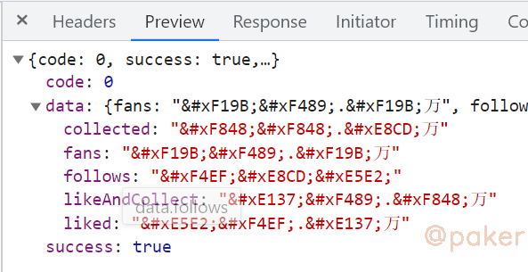
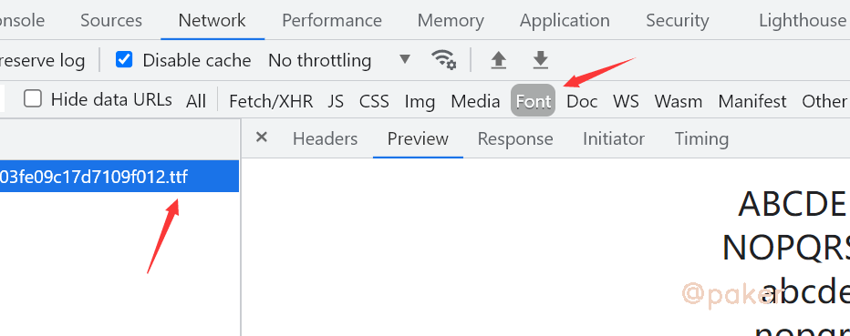
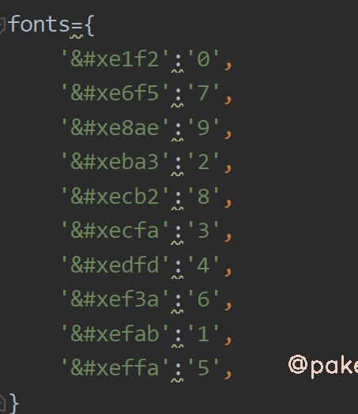

tags: spider
date: 2021年7月31日
title: 爬虫对抗-静态字体加密
private: false

# 爬虫对抗-静态字体加密

以某红书web端个人主页上的fensi数为例，记录下遇到了静态字体反爬怎么办？网址(base64)：

aHR0cHM6Ly93d3cueGlhb2hvbmdzaHUuY29tL3VzZXIvcHJvZmlsZS81YzZjMzA5OTAwMDAwMDAwMTAwMWQ3MGQ=

## 1.字体反爬长什么样

页面上看到的

接口返回的数据

## 2.解决方案

一般来说，我们会在网络请求里找到字体文件请求，如xxx.ttf文件。

由于是静态字体，可以理解为服务端与客户端规定了一套规则(eg. 你好=1，张三=2)。

爬虫er只需要固定一套字体映射表就可以搞定，但是我们不能一个一个和网页上去比对直到凑齐0-9等数据的映射关系吧？

这里推荐一个非常好用的网站，直接搞定。神器：https://font.qqe2.com/

直接将找到的ttf字体文件拖上去就可以，结果如下：一下子我们就知道8=$E137  1=$E343

最后在本地构建好字体映射表(字典)

