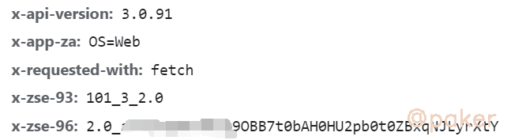
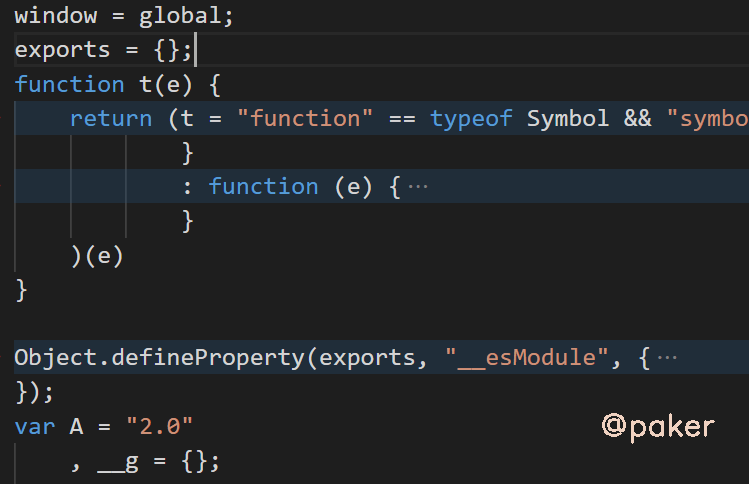

tags: spider js逆向
date: 2021年8月5日
title: 某乎搜索x-zse-96
private: false

# 某乎搜索x-zse-96

学习下某乎发现搜索接口header中的**x\-zse\-96**参数，好像20年还是86来着，忍不住吐槽一下，你不动我不动，大家一起摸鱼不香吗！

示例网址(base64)：

> aHR0cHM6Ly93d3cuemhpaHUuY29tL3NlYXJjaD90eXBlPWNvbnRlbnQmcT0lRTQlQjklOTIlRTQlQjklOTMlRTclOTQlQjclRTUlOUIlQTI=

## 1.抓包分析

接口：api/v4/search_v3?t=general&q=我爱祖国

请求参数：正常无加密(真善良)

请求头：x\-zse\-96加密了，测试发现cookie：d_c0=\*\*\*这个也很重要



## 2.加密定位

全局搜索zse-96，在main.app js中找到

>  m.set("x-zse-96", "2.0_" + j)

向上看看，j = A.signature，再看A的生成

> A = (0,    i.default)(t, O.body, {    zse93: g,    dc0: _,    xZst81: y })

其中t为api接口，g为101_3_2.0，dc0就是上文提到的cookie值，断点跟进去

>         return {
>             source: d,
>             signature: (0,
>             o.default)((0,
>             r.default)(d))
>         }

这里的signature就是x-zse-96的加密部分,d = 101_3_2.0+api接口+"cookie d_c0的值"

> d = "101_3_2.0+/api/v4/search_v3?t=general&q=%E5%A5%BD&correction=1&offset=0&limit=20&filter_fields=undefined&lc_idx=0&show_all_topics=0+\"AODv2CPTqiGpZwzarcdfWLvFCbYReY=|1574861159\""

继续断点跟进去，e就是上文的d，m(e, t, n)的返回值就是对d进行了MD5，我们可以在python部分进行拼接然后直接MD5

> function m(e, t, n) {
>             return t ? n ? O(t, e) : h(O(t, e)) : n ? v(e) : h(v(e))
>         }

继续跟进，我们看到最后return __g._encrypt(encodeURIComponent(e))，参数e是上文的MD5，我们只需将大括号区间之内的js代码拷到本地即可


## 3.扣代码



会报错缺少atob方法，因为nodejs和浏览器环境的差异，不存在window.atob给我们用，可以自己写一个base64编码解码函数，抄百度 [关于base64编码的原理及实现](https://blog.csdn.net/weixin_33766168/article/details/89613830)

```javascript
var base64hash  = 'ABCDEFGHIJKLMNOPQRSTUVWXYZabcdefghijklmnopqrstuvwxyz0123456789+/';
function atob(s) {
    s = s.replace(/\s|=/g, '');
    var cur, prev, mod, i = 0,
        result = [];
    while (i < s.length) {
        cur = base64hash.indexOf(s.charAt(i));
        mod = i % 4;
        switch (mod) {
            case 0:
                //TODO
                break;
            case 1:
                result.push(String.fromCharCode(prev << 2 | cur >> 4));
                break;
            case 2:
                result.push(String.fromCharCode((prev & 0x0f) << 4 | cur >> 2));
                break;
            case 3:
                result.push(String.fromCharCode((prev & 3) << 6 | cur));
                break;
        }
        prev = cur;
        i++;
    }
    return result.join('');
}
```

最后要注意的地方，扣下来的这段js生成的结果与浏览器生成的稍有不同，结尾多了9Tuw，需要自己截取！
